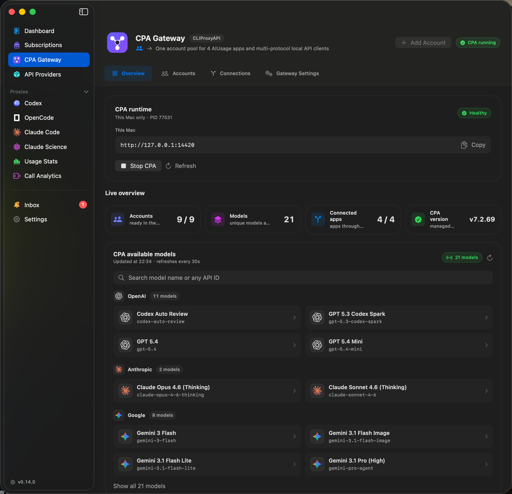
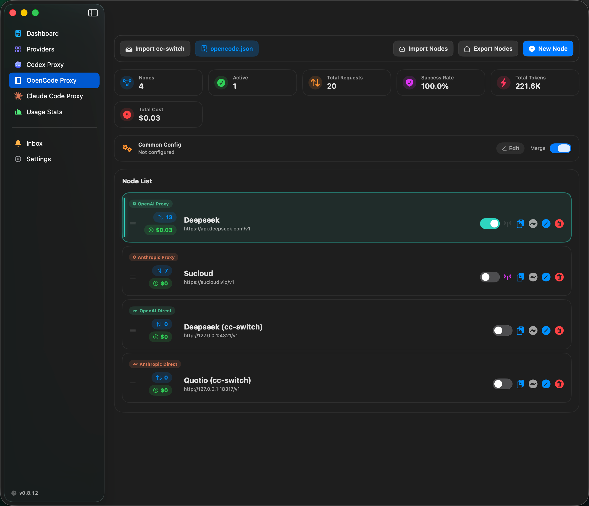
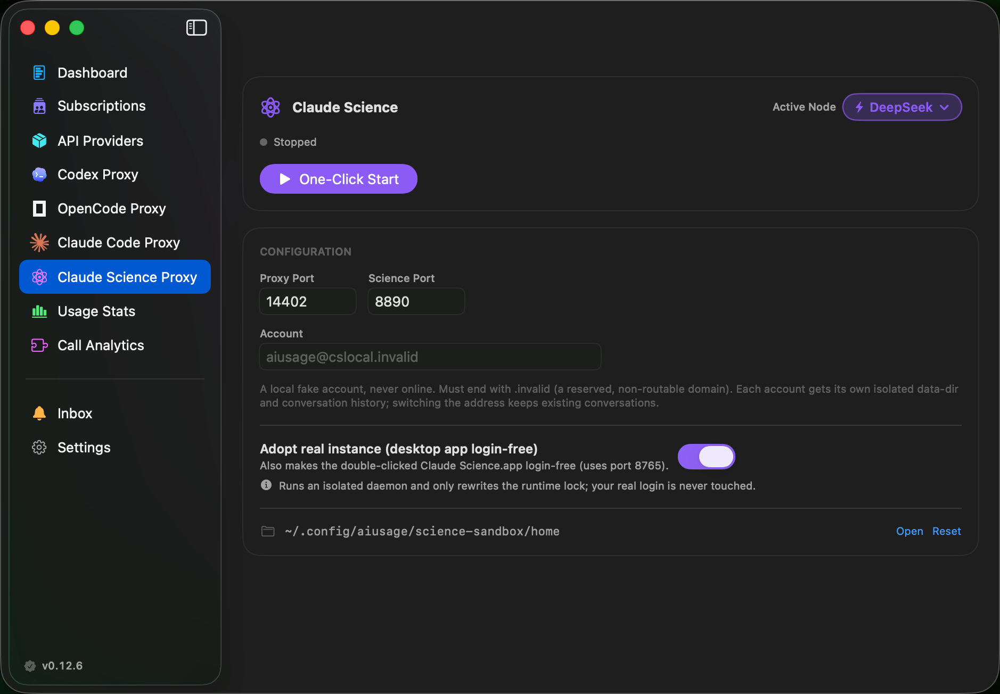
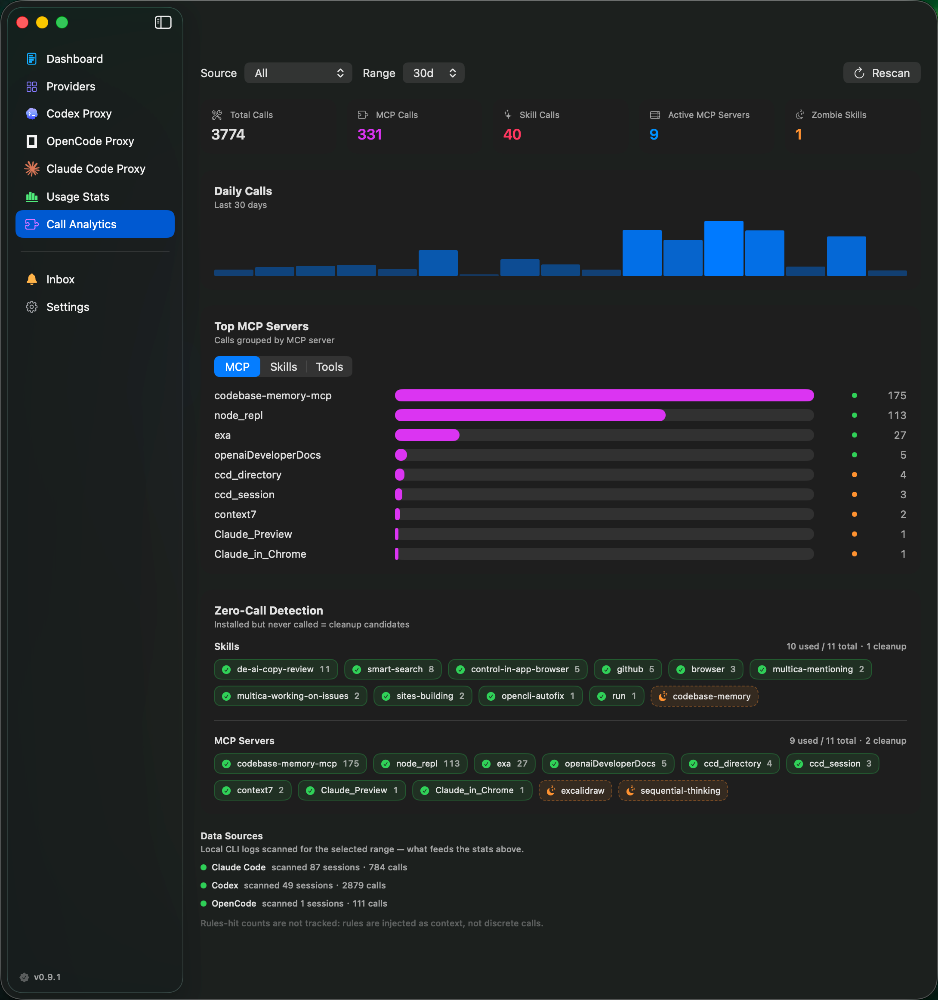

  

<h1 align="center">AIUsage</h1>

<h4 align="center">One dashboard for all your AI subscriptions</h4>

  Track quotas, costs, and accounts across 10+ AI providers. 
  Four native coding proxies, plus a managed CLIProxyAPI gateway that shares one subscription account pool across apps and API clients.

  <a href="README.zh-CN.md">中文说明</a> · <strong>English</strong>

  
  
  
  
  
  

  Sponsored by 
   
  500+ AI models · Text, image, video & audio · Top models included · Pay-as-you-go

  

---

## Table of Contents

- [Features](#features)
- [Preview](#preview)
- [Install](#install)
- [CPA Gateway](#cpa-gateway)
- [Proxies](#proxies)
- [Call Analytics](#call-analytics)
- [Acknowledgements](#acknowledgements)
- [Sponsor](#sponsor)
- [Support the Author](#support-the-author)
- [License](#license)

## Features

| Feature | Description |
| --- | --- |
| **12+ AI Providers** | Codex, Copilot, Cursor, Antigravity, Kiro, Warp, Gemini CLI, Droid, Claude Code, OpenCode, Kimi, MiniMax — one dashboard |
| **Multi-account** | Multiple accounts per provider, independent refresh, one-click CLI switching |
| **Usage Stats** | Unified cost & token breakdown from Claude/Codex proxy archives, token-only non-proxy Codex sessions, and OpenCode's local session ledger — per-model trends, time-period analysis, source-aware aggregation |
| **Claude Code Proxy** | Use Claude Code with DeepSeek, GPT, Ollama or any OpenAI-compatible model; Anthropic passthrough for usage logging |
| **Codex Proxy** | Point Codex CLI at any OpenAI-compatible upstream; unified switcher across subscription accounts and API nodes, surgical `config.toml` merge |
| **OpenCode Proxy** | Switch OpenCode across upstreams via a managed `opencode.json` block — OpenAI-compatible, Anthropic and Responses protocols, per-node usage attribution, per-model pricing and optional request logging |
| **Claude Science Proxy** | Launch local Claude Science without a Claude subscription and route its inference to any third-party model; local virtual login and an isolated sandbox, with optional adoption so the double-clicked desktop app is login-free too — never touching your real credentials |
| **CPA Gateway** | Run the official CLIProxyAPI as a managed local gateway: one OAuth account pool, live model discovery, multi-protocol APIs, optional LAN access, and one-click connections to Codex, Claude Code / Science, and OpenCode |
| **Global Proxy** | One fixed local endpoint per agent — hot-swap the active upstream node with zero CLI restart, per-node cost attribution, and automatic cross-track port arbitration |
| **Unified API Providers** | Configure one upstream (Base URL, format, key, model library/pricing) once and distribute it to Codex / Claude / OpenCode at once; linked nodes inherit from the master and sync on change, with per-field local overrides |
| **Call Analytics** | Count MCP / Skill / tool calls across Claude Code, Codex & OpenCode from local session logs — Top-N rankings, daily trend, and per-app zero-call ("zombie" skill/MCP) detection; read-only, zero instrumentation |
| **Menu Bar** | Multi-account status bar icons, quota/cost metrics, per-proxy node switchers, quick-glance popover, colored progress bars |
| **Credential Vault** | macOS Keychain storage for all managed credentials |

## Preview

<table>
  <tr>
    <td width="50%"></td>
    <td width="50%"></td>
  </tr>
  <tr>
    <td align="center"><strong>Dashboard</strong></td>
    <td align="center"><strong>Provider & Multi-account Monitoring</strong></td>
  </tr>
  <tr>
    <td colspan="2"></td>
  </tr>
  <tr>
    <td colspan="2" align="center"><strong>CPA Gateway · Managed Runtime, Account Pool &amp; Live Models</strong></td>
  </tr>
  <tr>
    <td width="50%"></td>
    <td width="50%"></td>
  </tr>
  <tr>
    <td align="center"><strong>Claude Code Proxy · Node Management</strong></td>
    <td align="center"><strong>Claude Code Proxy · Configuration</strong></td>
  </tr>
  <tr>
    <td width="50%"></td>
    <td width="50%"></td>
  </tr>
  <tr>
    <td align="center"><strong>Codex Proxy · Nodes &amp; Subscriptions</strong></td>
    <td align="center"><strong>OpenCode Proxy · Nodes &amp; Stats</strong></td>
  </tr>
  <tr>
    <td colspan="2"></td>
  </tr>
  <tr>
    <td colspan="2" align="center"><strong>Claude Science Proxy · Login-free Local Science</strong></td>
  </tr>
  <tr>
    <td width="50%"></td>
    <td width="50%"></td>
  </tr>
  <tr>
    <td align="center"><strong>Usage Stats (Claude, Codex &amp; OpenCode)</strong></td>
    <td align="center"><strong>Menu Bar</strong></td>
  </tr>
  <tr>
    <td colspan="2"></td>
  </tr>
  <tr>
    <td colspan="2" align="center"><strong>Call Analytics · MCP / Skill / Tool Usage</strong></td>
  </tr>
</table>

## Install

Download `.dmg` or `.zip` from the [Releases](https://github.com/sylearn/AIUsage/releases) page.

Universal Binary — runs natively on both Apple Silicon and Intel Macs (macOS 14+).

## CPA Gateway

> **New in v0.14.0** · Powered by the official [CLIProxyAPI](https://github.com/router-for-me/CLIProxyAPI) release.
>
> **Improved in v0.14.1** · CPA account synchronization now follows provider-native identity, safely converges verified historical copies, and keeps different workspaces or projects separate even when they share an email address.
>
> **Improved in v0.14.2** · A capability matrix now drives account semantics: only providers with a verified adapter (Codex, Antigravity) appear as "connect from AIUsage" candidates; Claude/Kimi/Grok are shown as CPA-native OAuth, Gemini CLI as an official plugin, and monitoring-only accounts (Cursor, Copilot, …) never enter the CPA pool. The Add Upstream wizard gains a safe multi-file import center with local recognition, preview, content/identity deduplication, per-file results, and a dedicated Codex auth.json converter.
>
> **Improved in v0.14.5** · Dashboard becomes a real home (quota attention summary instead of account cards). API Providers can distribute to CPA with loop guards, clearer sync feedback, and list filters. CPA account filters align with row alerts; runtime badge and tab dirty protection improve day-to-day ops.

CPA Gateway turns subscription accounts into one managed local API surface. AIUsage downloads, verifies, starts, updates, and can roll back CLIProxyAPI independently, so a CPA update does not require a new AIUsage release.

| Capability | What it does |
| --- | --- |
| **Unified account pool** | Add CPA-native OAuth accounts, install official provider plugins, configure compatible API-key upstreams, copy supported AIUsage accounts (Codex, Antigravity) into CPA, or migrate auth files with a recognized, deduplicated batch import |
| **Four managed apps** | Connect Codex, OpenCode, Claude Code, and Claude Science through the existing AIUsage proxy tracks without replacing their native capabilities |
| **Native client APIs** | Copy complete OpenAI Responses / Chat, Anthropic Messages, and Gemini endpoints from setup sheets, with legacy and advanced paths in the supported-route list |
| **Unified model catalog** | Collapse known CPA protocol aliases into one logical model, show recognized vendor logos, and expose the exact model ID required by each OpenAI, Anthropic, or Gemini client in model details |
| **Independent updates** | Install, verify, dry-run, promote, and roll back official CPA builds inside AIUsage while preserving runtime data and configuration |
| **Safe network boundary** | Loopback-only by default; LAN access is explicit, keeps remote management disabled, separates the hidden management key, and makes AIUsage call management only through loopback |

**Quick start:** Open AIUsage → CPA Gateway → install and start CPA → add an account → connect an AIUsage app or copy an endpoint for another client. See the [CPA Gateway architecture](docs/CLIPROXYAPI_INTEGRATION_DESIGN.md) for lifecycle, synchronization, routing, and security details.

## Proxies

AIUsage ships four independent proxies — for **Claude Code**, **Codex (Codex CLI)**, **OpenCode** and **Claude Science** — each with node management, usage logging and a unified switcher. CPA Gateway can be selected as their shared managed upstream without replacing any native proxy capability.

### Claude Code Proxy

Use Claude Code CLI with any OpenAI-compatible model, or transparently log Anthropic API usage.

| Mode | What it does |
|------|-------------|
| **OpenAI Proxy** | Translates Claude API → OpenAI format. Works with DeepSeek, GPT, Azure, Ollama, etc. |
| **Anthropic Passthrough** | Forwards requests as-is, logs input/output/cache tokens for cost tracking |

**Quick start:** Open AIUsage → Claude Code Proxy → New Node → Configure → Activate. Settings are written to `~/.claude/settings.json` automatically.

### Codex Proxy

Point the Codex CLI at any OpenAI-compatible upstream (Responses API), and switch between **subscription accounts** and **API nodes** from one place — they are mutually exclusive, so only one identity is ever active.

| Capability | What it does |
|------------|-------------|
| **OpenAI-compatible upstream** | Routes Codex CLI through any `responses`-compatible endpoint |
| **Unified switcher** | One toggle across subscription accounts (`~/.codex/auth.json`) and API nodes (`config.toml`) |
| **Surgical config merge** | Injects managed blocks into `~/.codex/config.toml` while preserving your own settings; global fragment + per-node TOML override |
| **cc-switch sync** | One-click import of Codex providers from local cc-switch (upstream / model / key), preserving `model_reasoning_effort`, `mcp_servers` and other settings; deterministic-id dedup avoids duplicate nodes (symmetric with Claude) |

**Quick start:** Open AIUsage → Codex Proxy → New Node (or pick a subscription account) → Configure → Activate. `~/.codex/config.toml` is merged automatically. Already on cc-switch? Hit "Sync cc-switch" in the toolbar to import in one click.

### OpenCode Proxy

Switch OpenCode between any number of upstreams without hand-editing `opencode.json`. AIUsage injects a managed provider block (and points the top-level `model` at it), then restores your original config on deactivate — the backup is the source of truth, so takeover is idempotent.

| Capability | What it does |
|------------|-------------|
| **Multi-protocol** | OpenAI-compatible (`@ai-sdk/openai-compatible`), Anthropic (`@ai-sdk/anthropic`) and OpenAI Responses (`@ai-sdk/openai`) — the npm package follows the node's protocol |
| **Direct or proxy mode** | Direct rewrites `opencode.json` to talk to the upstream; proxy mode points it at a local passthrough process for per-request logs (usage/cost still comes from `opencode.db`) |
| **Per-node usage** | Each node writes a distinct managed `providerID`, so the local OpenCode session ledger attributes tokens and models.dev-priced cost back to the right node |
| **Model library & pricing** | Per-node model list with independent per-model pricing (USD/CNY); pick the default model from the library and switch from the node card |
| **cc-switch sync** | One-click import of OpenCode providers from local cc-switch (upstream / models / key / pricing), deterministic-id dedup, configurable cc-switch directory |

**Quick start:** Open AIUsage → OpenCode Proxy → New Node → Configure models & pricing → Activate. `~/.config/opencode/opencode.json` is taken over automatically (requires OpenCode ≥ 1.2 for usage tracking).

### Claude Science Proxy

Launch a local [Claude Science](https://claude.com) instance without a Claude subscription, and route its inference to a third-party model of your choice through the local proxy — while keeping tool calls, Skills, MCP and code execution intact. For personal study and research only; use at your own risk.

| Capability | What it does |
|------------|-------------|
| **Local virtual login** | Forges a self-made virtual OAuth credential in an isolated data-dir to pass the login gate — zero Anthropic contact, never touching your real `~/.claude-science` |
| **Inference via third-party** | Points `ANTHROPIC_BASE_URL` at the reused local `QuotaServer`, strips inbound OAuth, injects your third-party key, and maps opus/sonnet/haiku tiers to the node's real models |
| **Isolated sandbox** | Separate HOME / port (14410) / data-dir / keychain, zero impact on the real instance; one click opens the logged-in page in your browser |
| **Adopt the real instance (optional)** | An 8765 reverse proxy plus a decoupled internal daemon (14411) makes the **double-clicked desktop app login-free too**; session bootstrap tolerates current daemon response/cookie formats and reports redacted diagnostics if upstream auth changes |
| **Shared node pool** | Reuses the Claude-family nodes from the Claude Code proxy; hot-swap the upstream at runtime, transparent to Science |

**Quick start:** Prepare an upstream node on the Claude Code proxy page first → Open AIUsage → Claude Science Proxy → pick a node → One-click start; your browser opens the logged-in Science automatically. See [docs/CLAUDE_SCIENCE_INTEGRATION.md](docs/CLAUDE_SCIENCE_INTEGRATION.md) for the technical design.

### Global Proxy

Instead of activating one node at a time, run a single fixed local endpoint per agent and hot-swap the active upstream behind it — the CLI never restarts and its config never changes.

| Capability | What it does |
|------------|-------------|
| **Fixed endpoint** | Each agent points at one stable local port once; switching upstreams is in-process and CLI-transparent |
| **LAN access (optional)** | Bind the global proxy to `0.0.0.0` so other devices on your LAN can reach it via your machine's IP (off by default) |
| **Hot-swap active node** | Change the active node with zero restart; each request is rewritten to that node's real upstream model |
| **Per-node attribution** | Cost and usage are recorded against the real active node and model, not a generic global bucket; ports are arbitrated across all three tracks to avoid collisions |

### Unified API Providers

Configure an upstream once and reuse it everywhere. Under **Providers → API Providers**, define a provider (Base URL, API format, key, model library and pricing) and distribute it to any combination of the three proxies — each gets a linked node.

| Capability | What it does |
|------------|-------------|
| **Configure once, distribute** | One config feeds Codex / Claude / OpenCode; a compatibility matrix limits where each format can go |
| **Inherit + local override** | Linked nodes follow the master and sync on change; editing a shared field on one node turns it into a local override that no longer syncs |
| **Safe lifecycle** | Idempotent re-distribution (no duplicates), port deconfliction for new nodes, and cascade delete or unlink when removing a master |

Usage and billing details for Claude Code and Codex are documented in [docs/USAGE_AND_BILLING.md](docs/USAGE_AND_BILLING.md). OpenCode cost is read directly from its local session ledger (`opencode.db`), pre-priced per [models.dev](https://models.dev).

---

## Call Analytics

See which **MCP servers, skills and tools** you actually use. AIUsage parses the local session logs of Claude Code, Codex and OpenCode — read-only, with zero instrumentation — and turns tool calls into usage insights: spot the MCP servers you rely on, and clean up "zombie" skills that were installed but never called.

| Capability | What it does |
|------------|-------------|
| **Top-N rankings** | MCP servers (folded by server), skills and built-in tools ranked by call count, with stable tie-breaking |
| **Daily trend** | Per-day call volume over the selected 7 / 30 / 90-day or all-time window |
| **Zero-call detection** | Flags installed-but-never-called skills and configured-but-unused MCP servers — scoped per app, so each tool's own cleanup candidates are actionable |
| **Per-source scope** | Filter by Claude Code / Codex / OpenCode or view all; skills and MCP are attributed to each tool by its own skill directories and config files |

> Codex skill calls are heuristic — Codex has no discrete skill-invocation event, so they are inferred from `SKILL.md` reads. Rule-hit counts are not tracked: rules are injected as context, not discrete calls.

---

## Acknowledgements

CPA Gateway runs the official [`router-for-me/CLIProxyAPI`](https://github.com/router-for-me/CLIProxyAPI) release as an optional, separately updated local sidecar. CLIProxyAPI remains an independent upstream project under its own license; see [Third-Party Notices](THIRD_PARTY_NOTICES.md).

Product inspiration and implementation references include [`CodexBar`](https://github.com/steipete/CodexBar) and [`Quotio`](https://github.com/nguyenphutrong/quotio).

## Sponsor

  

  <a href="https://sucloud.vip"><strong>Sucloud</strong></a> — AI API aggregation platform with 500+ models. 
  Full modality coverage (text, image, video, audio) including Claude, GPT, Gemini and more. 
  RMB payment supported, no overseas card required.

  
  
  

## Support the Author

If AIUsage helps you, consider buying the author a coffee. Your support helps keep the project maintained and improved.

  

## Friendly Links

- [Linux.do Community](https://linux.do)

## License

[Apache License 2.0](LICENSE)

## Star History

