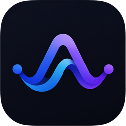
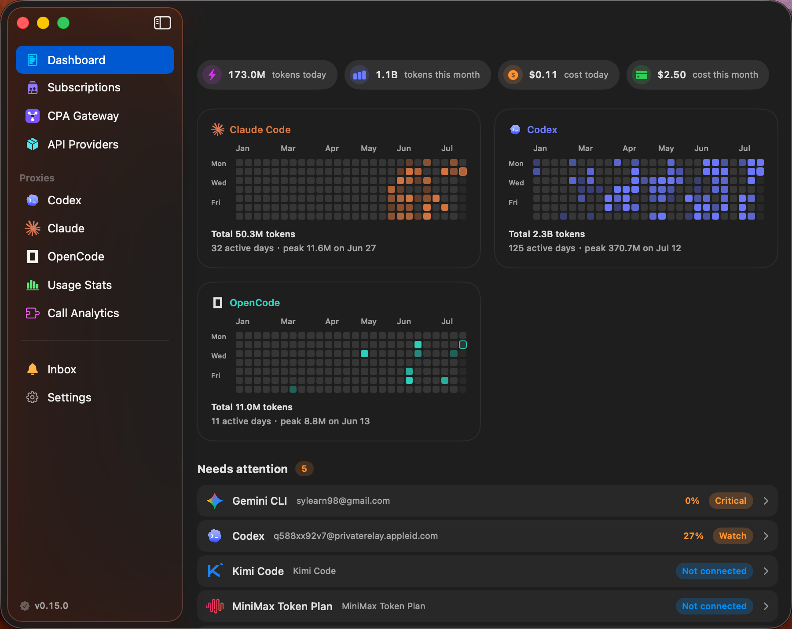
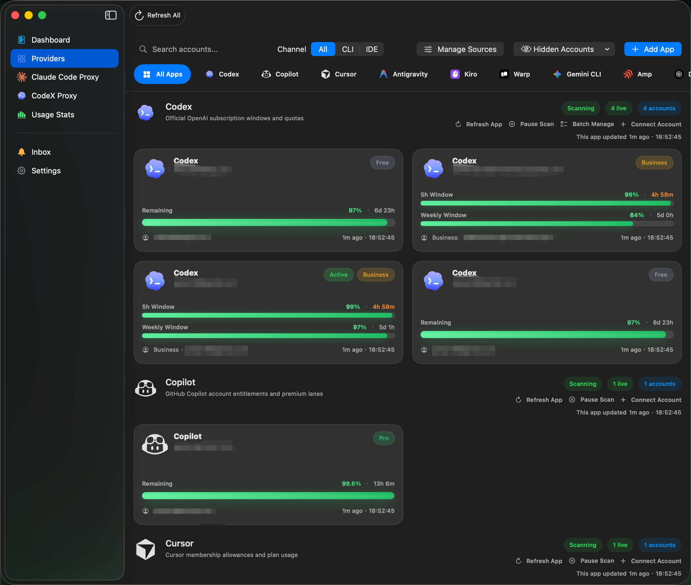
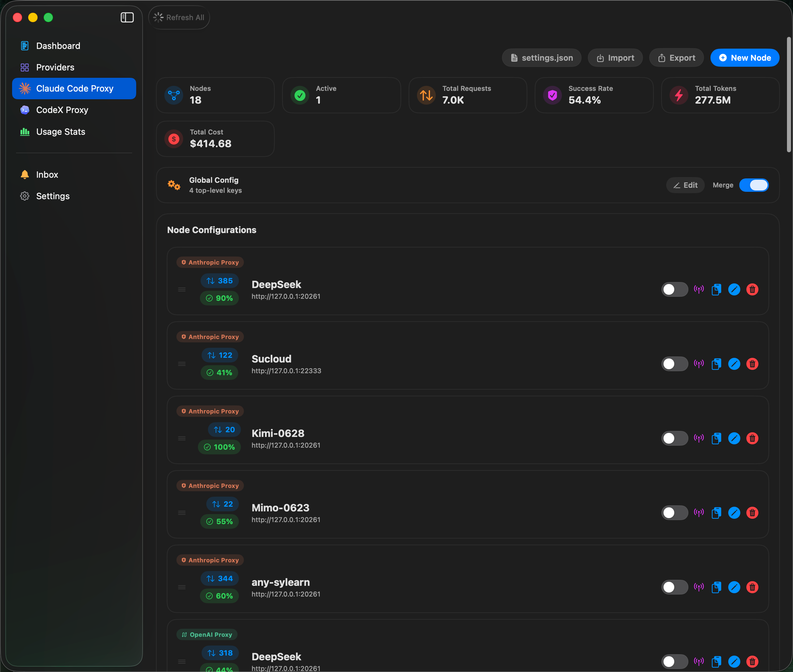
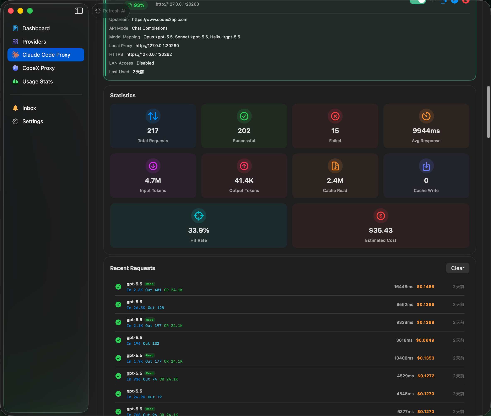
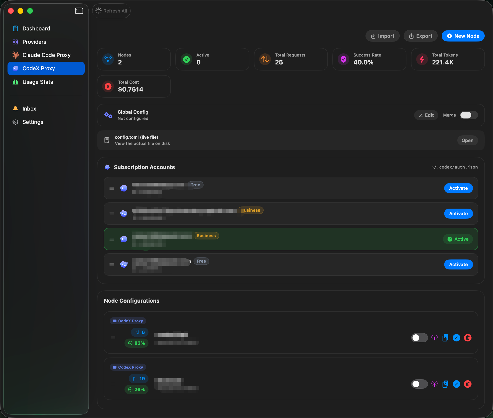
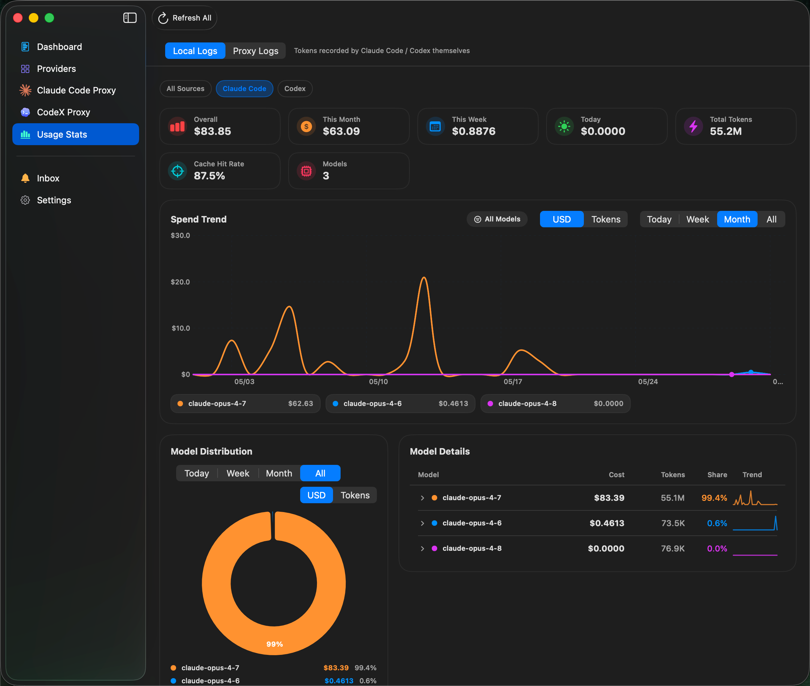
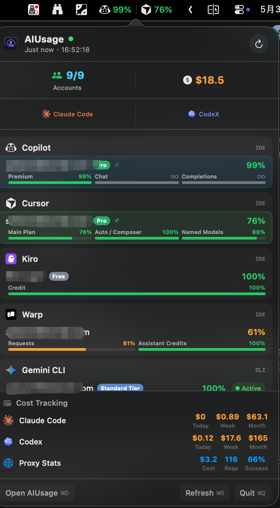

  

<h1 align="center">AIUsage</h1>

<h4 align="center">One dashboard for all your AI subscriptions</h4>

  Track quotas, costs, and accounts across 10+ AI providers. 
  Built-in Claude Code proxy for any OpenAI-compatible model.

  <a href="README.zh-CN.md">中文说明</a> · <strong>English</strong>

  
  
  
  
  
  

  Sponsored by 
   
  500+ AI models · Text, image, video & audio · Top models included · Pay-as-you-go

  

---

## Table of Contents

- [Features](#features)
- [Preview](#preview)
- [Install](#install)
- [Proxies](#proxies)
- [Acknowledgements](#acknowledgements)
- [Sponsor](#sponsor)
- [Support the Author](#support-the-author)
- [License](#license)

## Features

| Feature | Description |
| --- | --- |
| **12+ AI Providers** | Codex, Copilot, Cursor, Antigravity, Kiro, Warp, Gemini CLI, Amp, Droid, Claude Code, Kimi, MiniMax — one dashboard |
| **Multi-account** | Multiple accounts per provider, independent refresh, one-click CLI switching |
| **Usage Stats** | Unified cost & token breakdown across **Local Logs** (Claude Code / Codex sessions) and **Proxy Logs** — per-model trends, time-period analysis, source-aware "All Sources" aggregation |
| **Claude Code Proxy** | Use Claude Code with DeepSeek, GPT, Ollama or any OpenAI-compatible model; Anthropic passthrough for usage logging |
| **CodeX Proxy** | Point Codex CLI at any OpenAI-compatible upstream; unified switcher across subscription accounts and API nodes, surgical `config.toml` merge |
| **Menu Bar** | Multi-account status bar icons, quota/cost metrics, quick-glance popover, colored progress bars |
| **Credential Vault** | macOS Keychain storage for all managed credentials |

## Preview

<table>
  <tr>
    <td width="50%"></td>
    <td width="50%"></td>
  </tr>
  <tr>
    <td align="center"><strong>Dashboard</strong></td>
    <td align="center"><strong>Provider & Multi-account Monitoring</strong></td>
  </tr>
  <tr>
    <td width="50%"></td>
    <td width="50%"></td>
  </tr>
  <tr>
    <td align="center"><strong>Claude Code Proxy · Node Management</strong></td>
    <td align="center"><strong>Claude Code Proxy · Configuration</strong></td>
  </tr>
  <tr>
    <td width="50%"></td>
    <td width="50%"></td>
  </tr>
  <tr>
    <td align="center"><strong>CodeX Proxy · Nodes &amp; Subscriptions</strong></td>
    <td align="center"><strong>Usage Stats (Claude &amp; Codex)</strong></td>
  </tr>
  <tr>
    <td colspan="2" align="center"></td>
  </tr>
  <tr>
    <td colspan="2" align="center"><strong>Menu Bar</strong></td>
  </tr>
</table>

## Install

Download `.dmg` or `.zip` from the [Releases](https://github.com/sylearn/AIUsage/releases) page.

## Proxies

AIUsage ships two independent proxies — one for **Claude Code**, one for **CodeX (Codex CLI)** — each with node management, usage logging and a unified switcher.

### Claude Code Proxy

Use Claude Code CLI with any OpenAI-compatible model, or transparently log Anthropic API usage.

| Mode | What it does |
|------|-------------|
| **OpenAI Proxy** | Translates Claude API → OpenAI format. Works with DeepSeek, GPT, Azure, Ollama, etc. |
| **Anthropic Passthrough** | Forwards requests as-is, logs input/output/cache tokens for cost tracking |

**Quick start:** Open AIUsage → Claude Code Proxy → New Node → Configure → Activate. Settings are written to `~/.claude/settings.json` automatically.

### CodeX Proxy

Point the Codex CLI at any OpenAI-compatible upstream (Responses API), and switch between **subscription accounts** and **API nodes** from one place — they are mutually exclusive, so only one identity is ever active.

| Capability | What it does |
|------------|-------------|
| **OpenAI-compatible upstream** | Routes Codex CLI through any `responses`-compatible endpoint |
| **Unified switcher** | One toggle across subscription accounts (`~/.codex/auth.json`) and API nodes (`config.toml`) |
| **Surgical config merge** | Injects managed blocks into `~/.codex/config.toml` while preserving your own settings; global fragment + per-node TOML override |

**Quick start:** Open AIUsage → CodeX Proxy → New Node (or pick a subscription account) → Configure → Activate. `~/.codex/config.toml` is merged automatically.

---

## Acknowledgements

Inspired by [`CodexBar`](https://github.com/steipete/CodexBar) and [`Quotio`](https://github.com/nguyenphutrong/quotio).

## Sponsor

  

  <a href="https://sucloud.vip"><strong>Sucloud</strong></a> — AI API aggregation platform with 500+ models. 
  Full modality coverage (text, image, video, audio) including Claude, GPT, Gemini and more. 
  RMB payment supported, no overseas card required.

  
  
  

## Support the Author

If AIUsage helps you, consider buying the author a coffee. Your support helps keep the project maintained and improved.

  

## Friendly Links

- [Linux.do Community](https://linux.do)

## License

[Apache License 2.0](LICENSE)
