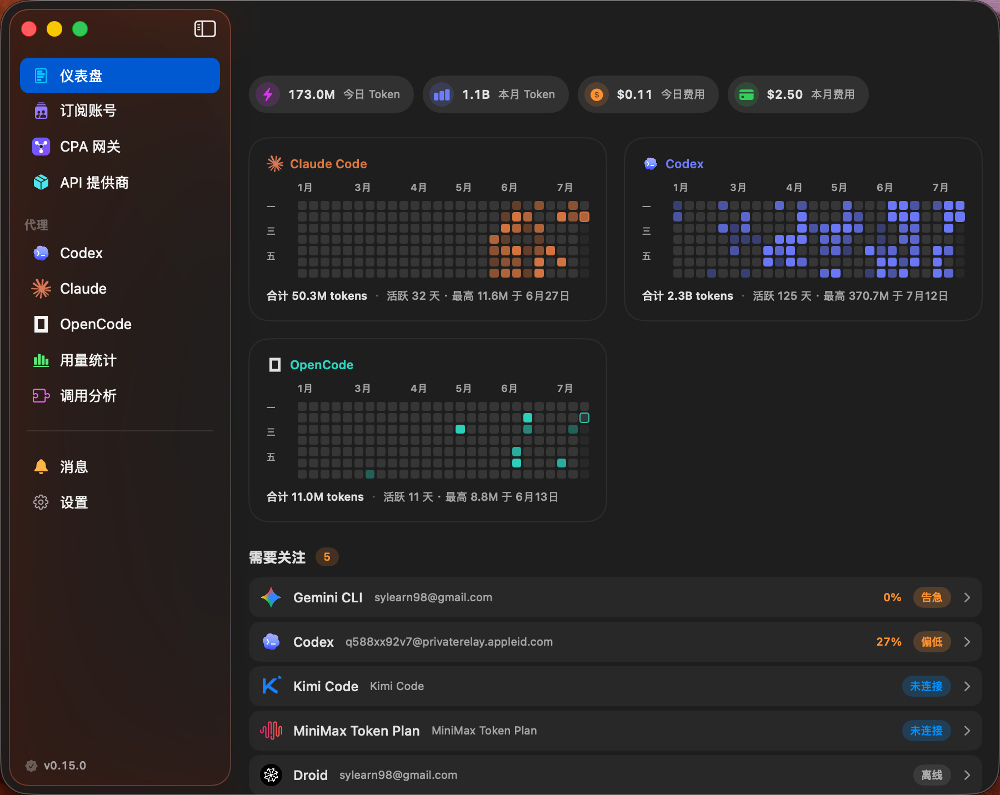
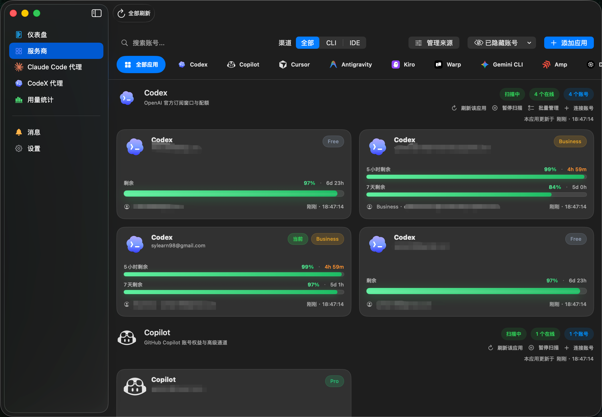
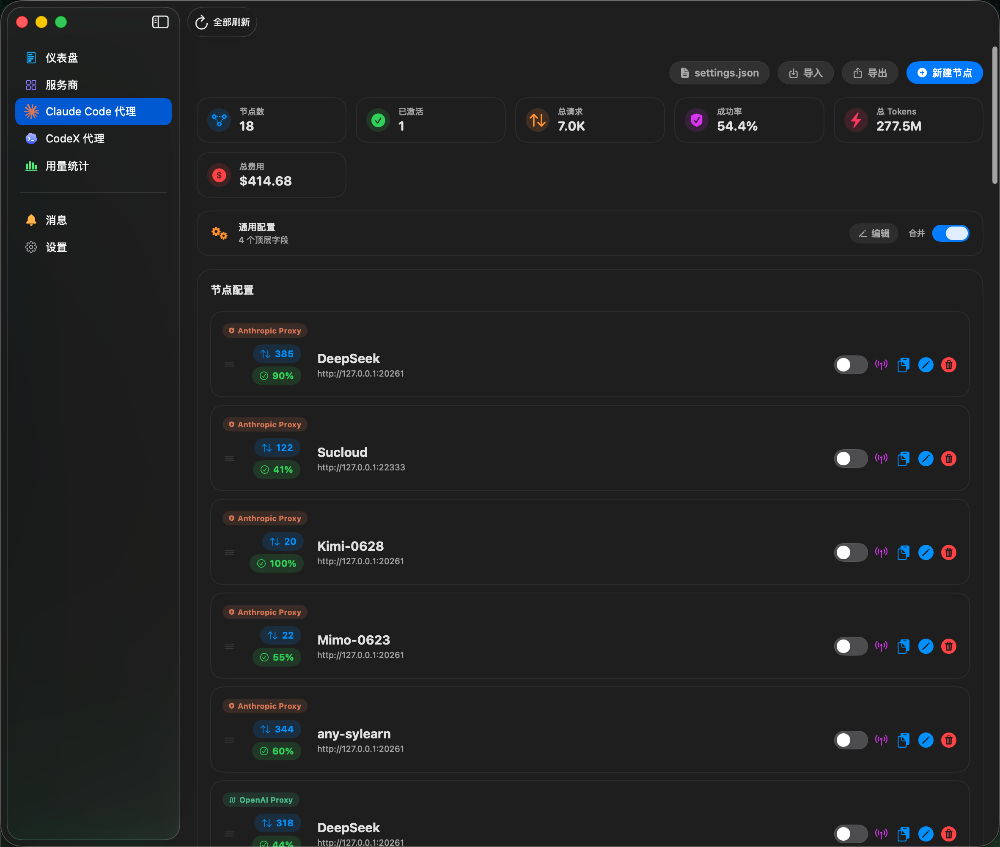
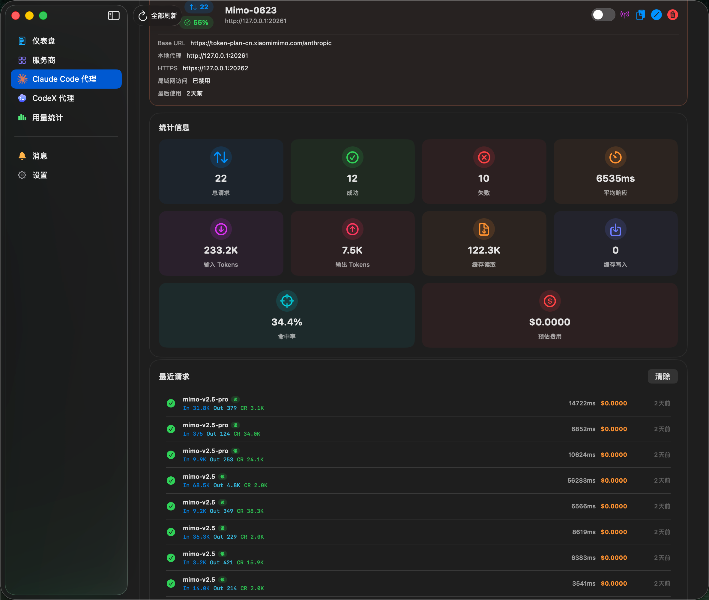
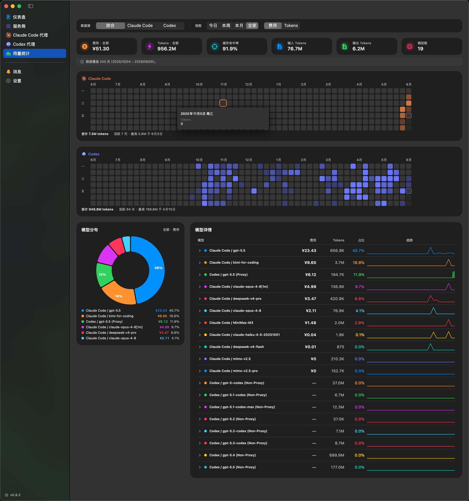
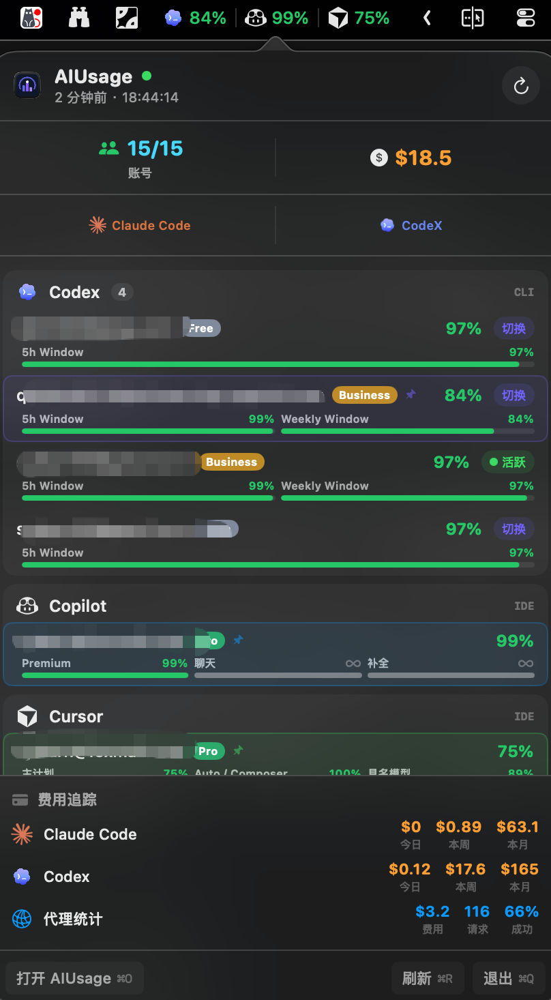

# AIUsage

  

  <strong>AI 订阅一站式看板 — 额度、费用、多账号、Claude Code 代理，尽在掌控。</strong>

  <a href="README.md">English</a> · <strong>中文说明</strong>

  
  
  
  

  

## 功能

| 功能 | 说明 |
| --- | --- |
| **10+ AI 服务商** | Codex、Copilot、Cursor、Antigravity、Kiro、Warp、Gemini CLI、Amp、Droid、Claude Code — 一个看板搞定 |
| **多账号管理** | 同一服务商多个账号独立刷新，一键切换 CLI 活跃账号 |
| **Claude Code 统计** | 按模型拆分费用与 Token，趋势曲线，多时段分析 |
| **Claude Code 代理** | 用 Claude Code 跑 DeepSeek、GPT、Ollama 等任意 OpenAI 兼容模型；Anthropic 透传模式记录用量 |
| **代理统计** | 按模型的费用/Token 趋势、分布图，可配置日志保留天数 |
| **菜单栏快览** | 多账号状态栏图标 + 配额/费用指标，快览弹窗含摘要统计、彩色进度条、费用追踪 |
| **凭证保险库** | macOS Keychain 安全存储 |

## 界面预览

<table>
  <tr>
    <td width="50%"></td>
    <td width="50%"></td>
  </tr>
  <tr>
    <td align="center"><strong>仪表盘</strong></td>
    <td align="center"><strong>服务商与多账号监控</strong></td>
  </tr>
  <tr>
    <td width="50%"></td>
    <td width="50%"></td>
  </tr>
  <tr>
    <td align="center"><strong>Claude Code 统计</strong></td>
    <td align="center"><strong>账号详情</strong></td>
  </tr>
  <tr>
    <td width="50%"></td>
    <td width="50%"></td>
  </tr>
  <tr>
    <td align="center"><strong>代理节点管理</strong></td>
    <td align="center"><strong>代理配置</strong></td>
  </tr>
  <tr>
    <td width="50%"></td>
    <td width="50%"></td>
  </tr>
  <tr>
    <td align="center"><strong>代理统计</strong></td>
    <td align="center"><strong>菜单栏</strong></td>
  </tr>
</table>

## 安装

从 [Releases](https://github.com/sylearn/AIUsage/releases) 页面下载 `.dmg` 或 `.zip`。

## Claude Code 代理

将 Claude Code CLI 接入任意 OpenAI 兼容模型，或透明记录 Anthropic API 用量。

| 模式 | 说明 |
|------|------|
| **OpenAI 代理** | Claude API → OpenAI 格式转换，支持 DeepSeek、GPT、Azure、Ollama 等 |
| **Anthropic 透传** | 请求原样转发，记录输入/输出/缓存 Token，精确追踪费用 |

**快速开始：** 打开 AIUsage → Claude Code 代理 → 新建节点 → 配置 → 激活。`~/.claude/settings.json` 自动更新。

## 致谢

灵感参考自 [`CodexBar`](https://github.com/steipete/CodexBar) 与 [`Quotio`](https://github.com/nguyenphutrong/quotio)。

## 友链

- [Linux.do 社区](https://linux.do)

## 许可证

[Apache License 2.0](LICENSE)
