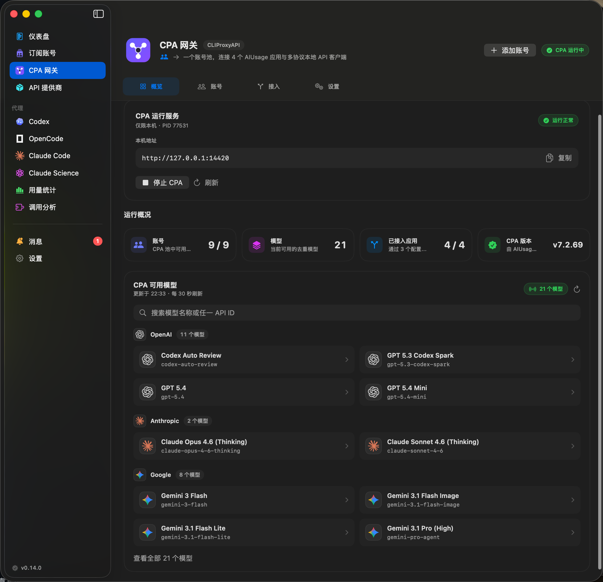
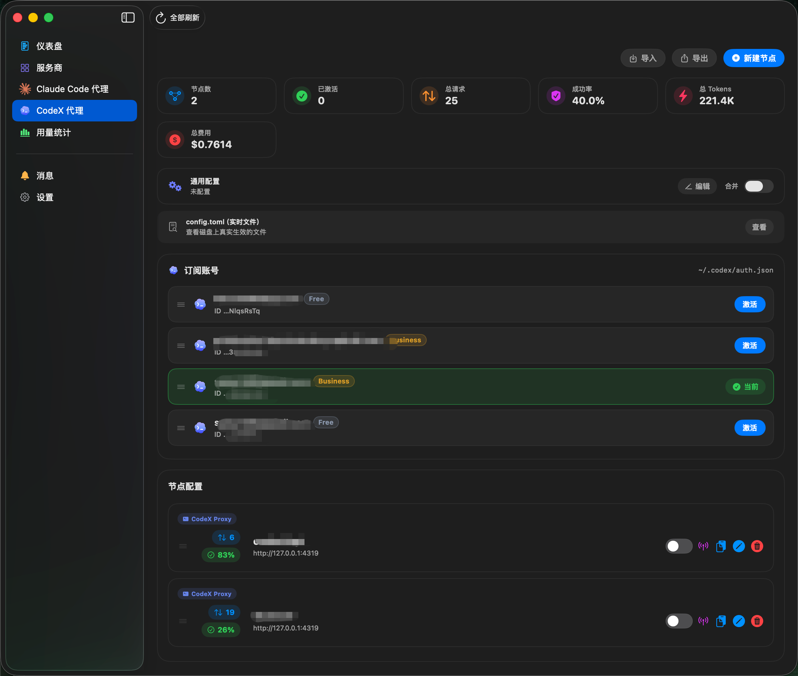
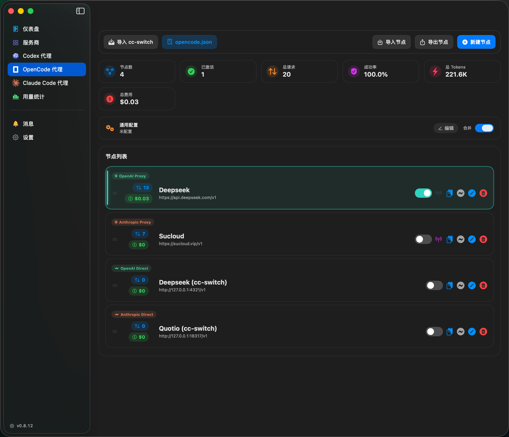
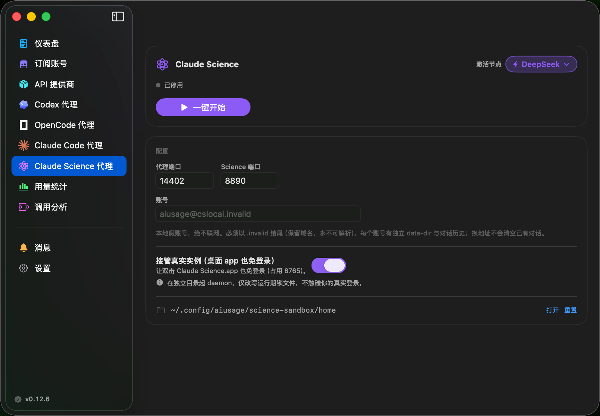
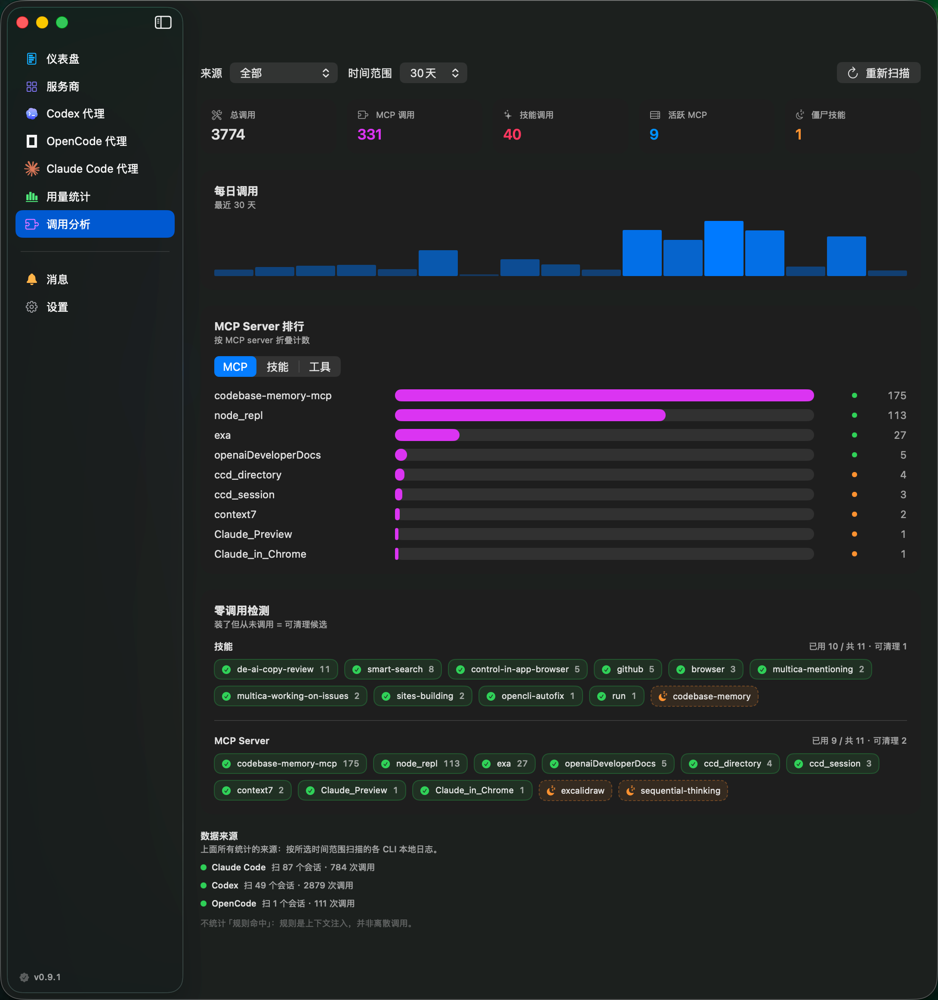

  

<h1 align="center">AIUsage</h1>

<h4 align="center">AI 订阅一站式看板</h4>

  额度、费用、多账号、代理切换，尽在掌控。 
  四套原生编程代理，加上一套受管 CLIProxyAPI 网关：一个订阅账号池，同时服务多个应用与 API 客户端。

  <a href="README.md">English</a> · <strong>中文说明</strong>

  
  
  
  
  
  

  赞助商 
   
  500+ AI 模型 · 文本/图像/视频/音频全模态覆盖 · 顶级模型全接入 · 按量计费

  

---

## 目录

- [功能](#功能)
- [界面预览](#界面预览)
- [安装](#安装)
- [CPA 网关](#cpa-网关)
- [代理](#代理)
- [调用分析](#调用分析)
- [致谢](#致谢)
- [赞助商](#赞助商)
- [支持作者](#支持作者)
- [许可证](#许可证)

## 功能

| 功能 | 说明 |
| --- | --- |
| **12+ AI 服务商** | Codex、Copilot、Cursor、Antigravity、Kiro、Warp、Gemini CLI、Droid、Claude Code、OpenCode、Kimi、MiniMax — 一个看板搞定 |
| **多账号管理** | 同一服务商多个账号独立刷新，一键切换 CLI 活跃账号 |
| **用量统计** | 统一汇总 Claude/Codex 代理归档、仅统计 Token 的 Codex 非代理会话，以及 OpenCode 本地会话账本：按模型拆分费用与 Token，趋势曲线、多时段分析，可按来源聚合查看 |
| **Claude Code 代理** | 用 Claude Code 跑 DeepSeek、GPT、Ollama 等任意 OpenAI 兼容模型；Anthropic 透传模式记录用量 |
| **Codex 代理** | 把 Codex CLI 指向任意 OpenAI 兼容上游；订阅账号与 API 节点统一切换器，外科式合并 `config.toml` |
| **OpenCode 代理** | 通过受管 `opencode.json` 块切换 OpenCode 上游——支持 OpenAI 兼容、Anthropic、Responses 三种协议，节点级用量归因、每模型定价、可选请求日志 |
| **Claude Science 代理** | 免订阅启动本地 Claude Science，推理经代理走任意第三方模型；本地虚拟登录、独立沙箱，可选接管让双击桌面 app 也免登录，全程不碰真实凭证 |
| **CPA 网关** | 把官方 CLIProxyAPI 作为受管本地网关运行：统一 OAuth 账号池、实时模型目录、多协议 API、可选局域网访问，并可一键接入 Codex、Claude Code / Science 与 OpenCode |
| **全局代理** | 每套代理一个固定本地入口——运行时热切换激活上游节点、CLI 零重启，按节点归因费用，跨轨端口自动仲裁 |
| **统一 API 提供商** | 一份上游配置（Base URL、接口格式、Key、模型库/定价）配好一次，即可一键分发到 Codex / Claude / OpenCode；链接节点继承主配置并随其变更同步，支持逐字段局部覆盖 |
| **调用分析** | 解析 Claude Code、Codex、OpenCode 的本地会话日志，统计 MCP / 技能 / 工具调用次数 —— Top-N 排行、每日趋势、按应用的零调用（「僵尸技能/MCP」）检测；只读、零埋点 |
| **菜单栏快览** | 多账号状态栏图标 + 配额/费用指标、各代理节点切换器，快览弹窗含摘要统计、彩色进度条、费用追踪 |
| **凭证保险库** | macOS Keychain 安全存储 |

## 界面预览

<table>
  <tr>
    <td width="50%"></td>
    <td width="50%"></td>
  </tr>
  <tr>
    <td align="center"><strong>仪表盘</strong></td>
    <td align="center"><strong>服务商与多账号监控</strong></td>
  </tr>
  <tr>
    <td colspan="2"></td>
  </tr>
  <tr>
    <td colspan="2" align="center"><strong>CPA 网关 · 托管运行时、账号池与实时模型</strong></td>
  </tr>
  <tr>
    <td width="50%"></td>
    <td width="50%"></td>
  </tr>
  <tr>
    <td align="center"><strong>Claude Code 代理 · 节点管理</strong></td>
    <td align="center"><strong>Claude Code 代理 · 配置</strong></td>
  </tr>
  <tr>
    <td width="50%"></td>
    <td width="50%"></td>
  </tr>
  <tr>
    <td align="center"><strong>Codex 代理 · 节点与订阅</strong></td>
    <td align="center"><strong>OpenCode 代理 · 节点与统计</strong></td>
  </tr>
  <tr>
    <td colspan="2"></td>
  </tr>
  <tr>
    <td colspan="2" align="center"><strong>Claude Science 代理 · 免登录本地 Science</strong></td>
  </tr>
  <tr>
    <td width="50%"></td>
    <td width="50%"></td>
  </tr>
  <tr>
    <td align="center"><strong>用量统计（Claude、Codex 与 OpenCode）</strong></td>
    <td align="center"><strong>菜单栏</strong></td>
  </tr>
  <tr>
    <td colspan="2"></td>
  </tr>
  <tr>
    <td colspan="2" align="center"><strong>调用分析 · MCP / 技能 / 工具用量</strong></td>
  </tr>
</table>

## 安装

从 [Releases](https://github.com/sylearn/AIUsage/releases) 页面下载 `.dmg` 或 `.zip`。

Universal Binary —— Apple Silicon 与 Intel 芯片 Mac 均原生运行（macOS 14+）。

## CPA 网关

> **v0.14.0 新增** · 由官方 [CLIProxyAPI](https://github.com/router-for-me/CLIProxyAPI) 发布版提供网关能力。

CPA 网关把订阅账号汇聚成一套受管本地 API。AIUsage 可以独立下载、校验、启动、更新和回滚 CLIProxyAPI，因此更新 CPA 不需要等待 AIUsage 发布新版本。

| 能力 | 说明 |
| --- | --- |
| **统一账号池** | 添加 CPA 原生 OAuth 账号、导入 auth JSON、配置兼容 API Key 上游，或将支持的 AIUsage 账号显式复制到 CPA |
| **托管四个应用** | 通过现有代理轨接入 Codex、OpenCode、Claude Code 与 Claude Science，完整保留各代理原有能力 |
| **原生客户端 API** | 在接入详情中完整查看并复制 OpenAI Responses / Chat、Anthropic Messages 与 Gemini 接口，并在支持路由列表中查看 legacy 与高级路径 |
| **统一模型目录** | 将已知 CPA 协议别名归并为一个逻辑模型，显示可识别厂商 Logo，并在模型详情中提供 OpenAI、Anthropic、Gemini 客户端各自需要的准确模型 ID |
| **独立更新** | 在 AIUsage 内安装、校验、试运行、提升或回滚官方 CPA 版本，同时保留运行数据与配置 |
| **安全网络边界** | 默认只允许本机访问；局域网访问需主动开启，远程管理策略保持关闭，管理密钥独立且不展示，AIUsage 只通过 loopback 调用管理接口 |

**快速开始：** 打开 AIUsage → CPA 网关 → 安装并启动 CPA → 添加账号 → 接入 AIUsage 应用，或为其他客户端复制接口。生命周期、同步、路由与安全细节见 [CPA 网关架构文档](docs/CLIPROXYAPI_INTEGRATION_DESIGN.md)。

## 代理

AIUsage 内置四套相互独立的代理 —— 分别面向 **Claude Code**、**Codex（Codex CLI）**、**OpenCode** 与 **Claude Science**，各自支持节点管理、用量记录与统一切换器。CPA 网关可以作为它们共同消费的受管上游，不会替代任何原生代理能力。

### Claude Code 代理

将 Claude Code CLI 接入任意 OpenAI 兼容模型，或透明记录 Anthropic API 用量。

| 模式 | 说明 |
|------|------|
| **OpenAI 代理** | Claude API → OpenAI 格式转换，支持 DeepSeek、GPT、Azure、Ollama 等 |
| **Anthropic 透传** | 请求原样转发，记录输入/输出/缓存 Token，精确追踪费用 |

**快速开始：** 打开 AIUsage → Claude Code 代理 → 新建节点 → 配置 → 激活。`~/.claude/settings.json` 自动更新。

### Codex 代理

把 Codex CLI 指向任意 OpenAI 兼容上游（Responses API），并在**订阅账号**与 **API 节点**之间一处切换 —— 两者互斥，任意时刻只有一个身份生效。

| 能力 | 说明 |
|------|------|
| **OpenAI 兼容上游** | 让 Codex CLI 走任意 `responses` 兼容端点 |
| **统一切换器** | 订阅账号（`~/.codex/auth.json`）与 API 节点（`config.toml`）一个开关统一切换 |
| **外科式合并** | 向 `~/.codex/config.toml` 注入受管理块、保留你的原有配置；通用配置片段 + 节点级 TOML 覆盖 |
| **cc-switch 一键同步** | 从本地 cc-switch 一键导入 Codex 供应商（上游 / 模型 / Key），保真保留 `model_reasoning_effort`、`mcp_servers` 等配置；确定性 ID 去重，重复同步不建重复节点（与 Claude 对称） |

**快速开始：** 打开 AIUsage → Codex 代理 → 新建节点（或选择订阅账号）→ 配置 → 激活。`~/.codex/config.toml` 自动合并。已用 cc-switch？点工具栏「同步 cc-switch」一键导入。

### OpenCode 代理

无需手改 `opencode.json`，即可在任意多个上游间切换 OpenCode。AIUsage 注入受管 provider 块（并把顶层 `model` 指向它），停用时整文件还原你的原始配置 —— 备份即事实源，接管/切换幂等。

| 能力 | 说明 |
|------|------|
| **多协议** | OpenAI 兼容（`@ai-sdk/openai-compatible`）、Anthropic（`@ai-sdk/anthropic`）、OpenAI Responses（`@ai-sdk/openai`）—— npm 包随节点协议自动选择 |
| **直连 / 代理两种模式** | 直连改写 `opencode.json` 直达上游；代理模式指向本地透传进程以记录请求级日志（用量/费用仍取自 `opencode.db`） |
| **节点级用量** | 每个节点写入独立的受管 `providerID`，本地会话账本据此把 Token 与按 models.dev 定价的费用归因到对应节点 |
| **模型库与定价** | 每节点维护模型列表 + 各模型独立定价（美元/人民币）；从模型库选默认模型，可在节点卡片直接切换 |
| **cc-switch 一键同步** | 从本地 cc-switch 一键导入 OpenCode 供应商（上游 / 模型 / Key / 定价），确定性 ID 去重，cc-switch 目录可配置 |

**快速开始：** 打开 AIUsage → OpenCode 代理 → 新建节点 → 配置模型与定价 → 激活。`~/.config/opencode/opencode.json` 自动接管（用量统计需 OpenCode ≥ 1.2）。

### Claude Science 代理

免 Claude 订阅启动本地 [Claude Science](https://claude.com)，把它的推理经本地代理导向你自选的第三方模型，同时保留工具调用、Skill、MCP、代码执行等原生体验。仅供个人学习研究，使用者自负风险。

| 能力 | 说明 |
|------|------|
| **本地虚拟登录** | 在独立 data-dir 写一份本地自造的虚拟 OAuth 凭证越过登录门，全程零 Anthropic 接触、不碰真实 `~/.claude-science` |
| **推理走第三方** | 通过 `ANTHROPIC_BASE_URL` 把推理导向复用的本地 `QuotaServer`，剥离入站 OAuth、注入你的第三方 Key，按 opus/sonnet/haiku 档位映射到节点真实模型 |
| **隔离沙箱** | 独立 HOME / 端口（14410）/ data-dir / 钥匙串，与真实实例零影响；浏览器一键打开已登录页 |
| **接管真实实例（可选）** | 由 8765 反向代理 + 独立内部 daemon（14411）让**双击桌面 app 也免登录**；会话初始化兼容新版 daemon 的响应/cookie 格式，上游认证变化时只输出脱敏诊断 |
| **复用节点池** | 与 Claude Code 代理共享 Claude 家族节点；运行时热切换上游，Science 无感 |

**快速开始：** 先在 Claude Code 代理页备好一个上游节点 → 打开 AIUsage → Claude Science 代理 → 选择节点 → 一键开始，浏览器自动打开已登录的 Science。技术细节见 [docs/CLAUDE_SCIENCE_INTEGRATION.md](docs/CLAUDE_SCIENCE_INTEGRATION.md)。

### 全局代理

不必一次只激活一个节点：每套代理对外只暴露一个固定本地入口，背后热切换激活上游 —— CLI 不重启、配置不变。

| 能力 | 说明 |
|------|------|
| **固定入口** | 每套代理一次性指向一个稳定的本地端口；切换上游走进程内热替换，CLI 无感 |
| **局域网访问（可选）** | 可将全局代理绑定到 `0.0.0.0`，让局域网内其他设备通过本机 IP 访问（默认关闭） |
| **热切换激活节点** | 切换激活节点零重启；每个请求会被改写为该节点真实的上游模型 |
| **按节点归因** | 费用与用量记到真实的激活节点与模型上，而非笼统的全局桶；端口在三套轨道间自动仲裁避免冲突 |

### 统一 API 提供商

一处配置，处处复用。在 **服务商 → API 提供商** 里定义一份上游（Base URL、接口格式、Key、模型库与定价），即可分发到三套代理的任意组合 —— 每套生成一个链接节点。

| 能力 | 说明 |
|------|------|
| **配置一次、分发多处** | 一份配置喂给 Codex / Claude / OpenCode；兼容矩阵约束每种格式可分发到哪些代理 |
| **继承 + 局部覆盖** | 链接节点跟随主配置并随其变更同步；在某个节点改了共享字段即转为本地覆盖，不再跟随 |
| **安全生命周期** | 重复分发幂等（不重复建节点）、新节点端口避让、删除主配置时可级联删除或解除链接 |

Claude Code 与 Codex 的用量、计费、缓存和归档细节见 [docs/USAGE_AND_BILLING.md](docs/USAGE_AND_BILLING.md)。OpenCode 的费用直接读取其本地会话账本（`opencode.db`），按 [models.dev](https://models.dev) 预先定价。

---

## 调用分析

看清你**真正在用哪些 MCP、技能和工具**。AIUsage 解析 Claude Code、Codex、OpenCode 的本地会话日志（只读、零埋点），把工具调用变成可用的洞察：识别高频依赖的 MCP，清理那些装了却从未调用的「僵尸技能」。

| 能力 | 说明 |
|------|------|
| **Top-N 排行** | MCP（按 server 折叠）、技能、内置工具按调用次数排行，同分稳定排序 |
| **每日趋势** | 按所选 7 / 30 / 90 天或全部历史窗口统计每日调用量 |
| **零调用检测** | 标出装了但从未调用的技能、配了却没用的 MCP —— 按应用归属，各工具自己的可清理候选一目了然 |
| **按来源筛选** | 可按 Claude Code / Codex / OpenCode 或全部查看；技能与 MCP 按各工具自己的技能目录与配置文件归属 |

> Codex 技能调用为启发式估算 —— Codex 没有离散的技能调用事件，靠读取 `SKILL.md` 推断。不统计「规则命中」：规则是上下文注入，并非离散调用。

---

## 致谢

CPA 网关会按需运行官方 [`router-for-me/CLIProxyAPI`](https://github.com/router-for-me/CLIProxyAPI) 发布版，并可独立更新。CLIProxyAPI 仍是采用其自身许可证的独立上游项目，详情见[第三方声明](THIRD_PARTY_NOTICES.md)。

产品思路与实现参考包括 [`CodexBar`](https://github.com/steipete/CodexBar) 与 [`Quotio`](https://github.com/nguyenphutrong/quotio)。

## 赞助商

  

  <a href="https://sucloud.vip"><strong>Sucloud</strong></a> — 为国内开发者提供稳定高效的 AI 生产力基座。 
  500+ 模型全模态覆盖（文本/图像/视频/音频），Claude、GPT、Gemini 等顶级模型全部接入。 
  人民币充值，无需海外卡，0.7¥ = $1 超高性价比。

  
  
  

## 支持作者

如果 AIUsage 对你有帮助，欢迎请作者喝一杯咖啡。你的支持会帮助项目持续维护与改进。

  

## 友链

- [Linux.do 社区](https://linux.do)

## 许可证

[Apache License 2.0](LICENSE)

## Star 趋势

