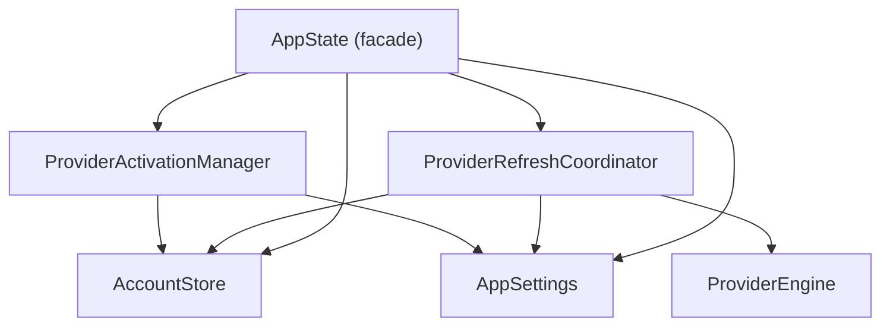
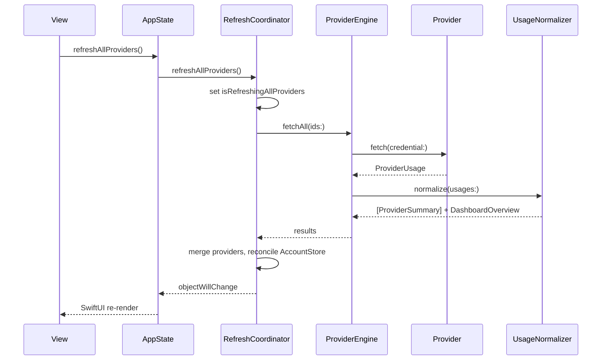

# AIUsage Architecture

## Overview

AIUsage is a macOS-native SwiftUI application that monitors AI subscription quotas across multiple providers, with an integrated Claude Code proxy for using third-party models. The codebase consists of two main modules: the **AIUsage app** (SwiftUI frontend + state management) and the **QuotaBackend** SwiftPM package (provider engines, normalizers, proxy runtime).

## Directory Structure

```
AIUsage/
├── AIUsageApp.swift              # @main, scene setup, EnvironmentObject wiring
├── Models/
│   ├── AppState.swift            # Thin facade: UI navigation + coordinator references
│   ├── AppSettings.swift         # UserDefaults-backed preferences (ObservableObject)
│   ├── AccountStore.swift        # Account registry & credential management
│   ├── ProviderModels.swift      # App-side ProviderData, alerts, etc.
│   ├── ProxyConfiguration.swift  # Proxy node config model (legacy, kept for compat) + NodeType / ProxyNodeFamily
│   └── NodeProfile.swift         # File-based node profile (_metadata + full settings.json)
├── Services/
│   ├── APIService.swift          # HTTP client for remote QuotaServer
│   ├── SecureAccountVault.swift  # Account registry; folded into AccountCredentialStore's single keychain item (one-time migration)
│   ├── SystemProxyDetector.swift # Detects macOS system proxy (Codex no_proxy fix)
│   ├── CodexNoProxyFixer.swift   # Writes/removes managed no_proxy block in ~/.codex/.env
│   ├── ProviderAuthManager.swift # Auth flow orchestration (slim router)
│   └── ProviderAuth/
│       ├── ProviderAuthTypes.swift
│       ├── ProviderManagedImportStore.swift
│       ├── CLIExecutableResolver.swift
│       ├── LoginPhase.swift              # Shared login phase enum for all login coordinators
│       ├── CodexLoginCoordinator.swift   # Browser login (CLI subprocess + auto-open system browser)
│       ├── GeminiLoginCoordinator.swift  # Browser login (loopback OAuth)
│       ├── AntigravityLoginCoordinator.swift # Browser login (loopback OAuth)
│       ├── CopilotLoginCoordinator.swift # GitHub device flow
│       ├── KiroLoginCoordinator.swift    # AWS SSO device flow
│       ├── ProviderAuthCandidateDiscovery.swift
│       └── ProviderAuthParsing.swift
├── ViewModels/
│   ├── ProviderRefreshCoordinator.swift  # Refresh engine, timers, data pipeline
│   ├── ProviderActivationManager.swift   # CLI active account detection
│   ├── ProxyViewModel.swift              # Proxy node lifecycle (dual track: Claude + Codex) & process management
│   ├── CodexConfigManager.swift          # ~/.codex/config.toml surgical merge + backup/restore
│   ├── NodeProfileStore.swift            # File-based profile CRUD (~/.config/aiusage/profiles/)
│   └── ClaudeSettingsManager.swift       # ~/.claude/settings.json full write + backup/restore
└── Views/
    ├── ContentView.swift           # NavigationSplitView shell; routes AppSection → detail view
    ├── SidebarNavigation.swift     # Single source of truth for sidebar nav items (drives ContentView list + Settings visibility toggles)
    ├── DashboardView.swift         # Main dashboard
    ├── ProviderCard.swift          # Rich quota card UI
    ├── ProvidersView.swift         # Subscriptions (.accounts) + API Providers (.apiProviders) — split of legacy "Providers"
    ├── CallAnalyticsView.swift     # "Call Analytics" entry (proxy request inspection)
    ├── StatsHubView.swift          # "Usage Stats" entry (thin wrapper over ProxyStatsView)
    ├── ProxyManagementView.swift   # Proxy node list (family-filtered: .claude / .codex) + gesture drag-to-reorder
    ├── CodexProxyManagementView.swift # Codex proxy menu (wraps ProxyManagementView(family: .codex))
    ├── OpenCodeManagementView.swift # OpenCode proxy menu (node list + opencode.json[c] takeover; JSONC via JSONCSanitizer)
    ├── CodexProxyEditorView.swift  # Codex node editor (single model)
    ├── SystemProxyWarningBanner.swift # System-proxy notice in Codex menu
    ├── ProxyStatsView.swift        # Proxy usage statistics (family-aware)
    ├── SettingsView.swift          # Preferences UI (sidebar navigation, 7 categories)
    ├── JSONRawEditorView.swift     # Raw JSON editor for node profiles
    ├── SettingsVisualEditorView.swift # Visual settings.json editor
    ├── ProfileExportView.swift     # Batch profile export UI
    ├── ProviderAccountEditorView.swift # "Connect account" sheet (per provider)
    ├── ProviderLoginStatusCard.swift   # Unified login card shared by all 5 login flows
    └── ...

QuotaBackend/Sources/
├── QuotaBackend/
│   ├── ProviderProtocol.swift    # Core protocols & types
│   ├── Engine/
│   │   ├── ProviderEngine.swift          # Concurrent provider orchestration
│   │   ├── ProviderRegistry.swift        # Static provider list
│   │   ├── AccountCredentialStore.swift  # Keychain credential storage
│   │   └── BrowserDiscovery.swift        # Browser profile helpers
│   ├── Providers/
│   │   ├── ClaudeProvider.swift         # Claude proxy usage archive reader
│   │   ├── CodexProvider.swift          # OpenAI Codex API (multi-workspace)
│   │   ├── CodexCostProvider.swift      # Codex proxy archive + non-proxy JSONL token ledger
│   │   ├── CopilotProvider.swift        # GitHub Copilot
│   │   ├── CursorProvider.swift         # Cursor IDE
│   │   ├── GeminiProvider.swift         # Google Gemini CLI
│   │   ├── DroidProvider.swift          # Droid (+API, +Auth, +Helpers, +Parsing)
│   │   ├── KimiProvider.swift           # Kimi Code subscription (/usages: weekly + rate-limit windows)
│   │   ├── KiroProvider.swift           # Kiro (+Auth, +Parsing)
│   │   ├── MiniMaxProvider.swift        # MiniMax Token Plan (/token_plan/remains: 5h + weekly)
│   │   ├── WarpProvider.swift           # Warp
│   │   └── AntigravityProvider.swift    # Antigravity (multi-workspace)
│   ├── Normalizer/
│   │   ├── UsageNormalizer.swift        # Raw → ProviderSummary + DashboardOverview
│   │   ├── UsageNormalizer+<Provider>.swift  # Per-provider normalizers (11 files)
│   │   └── ProviderSummary.swift        # Normalized summary structs
│   ├── ClaudeProxy/
│   │   ├── Canonical/             # Unified middle layer (production pipeline)
│   │   ├── Runtime/               # Proxy service, upstream client (+ CodexProxyConfiguration/Service)
│   │   ├── Conversion/            # Legacy converters (reference impl)
│   │   ├── Models/                # API model definitions
│   │   └── Utilities/             # SSE encoder
│   └── Utilities/
│       └── DateFormatting.swift   # Shared formatters (SharedFormatters, DateFormat)
└── QuotaServer/
    ├── main.swift                          # CLI entry point (PROXY_TARGET=codex selects Codex proxy)
    ├── QuotaHTTPServer.swift               # NWListener HTTP server + StreamingResponse
    ├── QuotaHTTPServer+ClaudeProxy.swift   # Claude API routing & streaming bridge
    ├── QuotaHTTPServer+CodexProxy.swift    # Codex /v1/responses + /v1/models faithful passthrough
    └── QuotaHTTPServer+Passthrough.swift   # Anthropic passthrough proxy
```

## Singleton Architecture



| Singleton | Responsibility |
|-----------|---------------|
| **AppState** | UI navigation state, selected providers, read-through forwarding, `objectWillChange` aggregation |
| **AppSettings** | UserDefaults-backed preferences: theme, language, refresh intervals, backend mode |
| **AccountStore** | Account registry, credential lifecycle, normalization/dedup, Keychain persistence |
| **ProviderRefreshCoordinator** | Refresh timers, `ProviderEngine` orchestration, local/remote fetch, data merging |
| **ProviderActivationManager** | CLI active account detection (Codex/Gemini), auth file I/O |

All singletons forward `objectWillChange` to `AppState`, so views observing `@EnvironmentObject var appState` refresh automatically.

## Data Flow: Provider Refresh



## Main Navigation & Sidebar (v0.11+)

The main window is a `NavigationSplitView` (`ContentView`) whose sidebar is driven by a single
source of truth — `SidebarNavigation` (`Views/SidebarNavigation.swift`). That same model also feeds
the **Settings → General** sidebar-visibility toggles, so item titles/icons/order never drift between
the two places.

**`AppSection`** (`Models/AppSettings.swift`) is the selected-section enum. The legacy single
`providers` entry was split into two sections in v0.11; its old rawValue (`"providers"`) is retained
**only** for migrating persisted state (hidden flags etc.) and is no longer a valid section.

| Section (`AppSection`) | Sidebar title (EN / 中文) | Detail view | Pinned? |
|------------------------|---------------------------|-------------|---------|
| `.dashboard`            | Dashboard / 仪表盘          | `DashboardView` | ✅ always |
| `.providerAccounts`     | Subscriptions / 订阅账号     | `ProvidersView(category: .accounts)` | hideable |
| `.apiProviders`         | API Providers / API 提供商   | `ProvidersView(category: .apiProviders)` | hideable |
| `.codexProxyManagement` | Codex Proxy / Codex 代理     | `CodexProxyManagementView` | hideable |
| `.opencodeManagement`   | OpenCode Proxy / OpenCode 代理 | `OpenCodeManagementView` | hideable |
| `.proxyManagement`      | Claude Code Proxy / Claude Code 代理 | `ProxyManagementView` | hideable |
| `.costTracking`         | Usage Stats / 用量统计       | `StatsHubView` | hideable |
| `.callAnalytics`        | Call Analytics / 调用分析    | `CallAnalyticsView` | hideable |
| `.inbox`                | Inbox / 消息                | `InboxView` (unread badge) | hideable |
| `.settings`             | Settings / 设置             | `SettingsView` | ✅ always |

- **Grouping**: `SidebarNavigation.primary` (dashboard → call analytics) renders above a divider;
  `SidebarNavigation.secondary` (inbox + settings) below it.
- **Three independent proxy entries**: Claude Code / Codex / OpenCode each get their own sidebar item
  (brand icon), matching the three independent proxy tracks (see Proxy Subsystem).
- **User-hideable visibility**: every item except Dashboard and Settings (`isHideable == false`) can be
  hidden via right-click → Hide or Settings → General. Hidden sections live in
  `AppSettings.hiddenSidebarSections` (UserDefaults). Hiding the current section falls back to Dashboard.
- The macOS **menu-bar** surface (`MenuBarView`, status item) is a separate entry point that reuses the
  same `AppState` data and can deep-link back into these sections via `AppState.presentMainWindow(section:)`.

## Proxy Subsystem

详细架构文档见 [PROXY_ARCHITECTURE.md](PROXY_ARCHITECTURE.md)。
Claude Code / Codex 的用量统计、计费、缓存和归档口径见 [USAGE_AND_BILLING.md](USAGE_AND_BILLING.md)。

三条相互独立、可同时激活的代理面（各有独立的侧边栏入口与激活状态）：

- **Claude Code 轨道**（`.anthropicDirect` / `.openaiProxy`）：写 `~/.claude/settings.json`。由 `ProxyViewModel` 用 `activatedConfigId` 跟踪。
- **Codex 轨道**（`.codexProxy`）：写 `~/.codex/config.toml`（`CodexConfigManager` 外科式合并），详见 PROXY_ARCHITECTURE.md「Codex 代理」章。由 `ProxyViewModel` 用 `activatedCodexConfigId` 跟踪。Claude/Codex 互斥仅限同家族 `ProxyNodeFamily`。
- **OpenCode 轨道**：由 `OpenCodeNodeStore` + `OpenCodeConfigManager` 独立管理（不经 `ProxyViewModel`），接管 `~/.config/opencode/opencode.json[c]`；支持 JSONC（注释/尾随逗号经 `JSONCSanitizer` 容错解析，原文由逐字备份保真还原）。

**Process lifecycle** (managed by `ProxyViewModel` + `ProxyRuntimeService`):

1. User activates a proxy node in the UI
2. `ProxyViewModel` executes transactional activation:
   - Loads full settings from `NodeProfileStore` profile (v0.5.0+) or legacy `ProxyConfiguration`
   - **Claude track**: writes complete `~/.claude/settings.json` via `ClaudeSettingsManager.writeFullSettings()` (auto-backup to `settings.backup.json`)
   - **Codex track**: spawns `QuotaServer(PROXY_TARGET=codex)`, then injects managed block into `~/.codex/config.toml` (backup-as-source-of-truth); if a system proxy is detected, writes `no_proxy` into `~/.codex/.env`
   - Spawns `QuotaServer` process (via `ProxyRuntimeService`)
   - Persists `activatedConfigId` / `activatedCodexConfigId` only after all steps succeed
3. Pipes stdout/stderr, parses `PROXY_LOG:` JSON lines for stats. Stats ingestion is main-thread-light:
   cache invalidation + `objectWillChange` are throttled to 0.5s, and all persistence (log shards,
   statistics, usage archive) is encoded and written on a background serial queue (`ProxyPersistence.queue`)
4. On deactivation: kills process, restores `settings.json` / `config.toml` (+ `.env`) from backup, rolls back state

**Proxy modes**:
- **OpenAI Convert** (Claude track): Claude API → Canonical Middle Layer → OpenAI `chat/completions` or `responses` → upstream
- **Anthropic Passthrough** (Claude track): Transparent forwarding with token usage logging
- **Codex Faithful Passthrough**: OpenAI Responses inbound forwarded verbatim to an OpenAI-compatible upstream (no Canonical rewrite; only model + auth adjusted)

**Conversion pipeline**: Claude-track protocol conversion goes through a Canonical Middle Layer (see [CANONICAL_MIDDLE_LAYER_DESIGN.md](CANONICAL_MIDDLE_LAYER_DESIGN.md)). The Codex track is passthrough-only in Phase B.

## Storage Locations

| Location | Content |
|----------|---------|
| **UserDefaults** | App preferences, selected providers, hidden sidebar sections, stats |
| **Keychain** (single item, owned by `AccountCredentialStore`) | Provider credentials (cookies, tokens, API keys) **plus** the account registry metadata (emails, notes, IDs) folded in as an auxiliary blob. Consolidated into one item in v0.12.1 so the app shows at most one "Always Allow" prompt; `SecureAccountVault` migrates its old standalone item once on first access. |
| `~/.config/aiusage/profiles/*.json` | Node profile files (`_metadata` + full `settings.json` content) |
| `~/.claude/settings.json` | Claude Code configuration (full replacement on activation) |
| `~/.claude/settings.backup.json` | Backup of `settings.json` before activation |
| `~/.config/aiusage/proxy-logs/proxy-logs-YYYY-MM-DD.json` | Short-retention proxy request log shards |
| `~/.config/aiusage/usage-archive/proxy-usage-claude-v1.json` | Claude proxy daily usage archive; token/cost fields are frozen when requests are logged |
| `~/.config/aiusage/usage-archive/proxy-usage-codex-v1.json` | Codex proxy daily usage archive; same frozen-cost semantics |
| `~/.codex/config.toml` | Codex configuration; managed `model_provider=aiusage-proxy` block injected on activation (chmod 0600) |
| `~/.codex/config.toml.aiusage.bak` | Backup of `config.toml` before injection (backup-as-source-of-truth; removed on restore) |
| `~/.config/opencode/opencode.json` 或 `opencode.jsonc` | OpenCode configuration; managed provider entries injected on activation. `$XDG_CONFIG_HOME` 优先；存在 `.jsonc` 时优先接管 `.jsonc`（JSONC 经 `JSONCSanitizer` 容错解析） |
| `~/.config/opencode/opencode.json[c].aiusage.bak` | Backup of the OpenCode config before takeover (verbatim copy preserves comments/formatting; restored on deactivation) |
| `~/.codex/.env` | Managed `no_proxy` block (loopback only) written when a system proxy is detected; removed on deactivation |
| `~/.codex/sessions/**/*.jsonl`, `~/.codex/archived_sessions/**/*.jsonl` | Codex non-proxy session logs (read-only token source for CodexCostProvider; overridable via `$CODEX_HOME`) |
| `~/Library/Caches/AIUsage/codex-cost-file-cache-v*.json` | CodexCostFileScanCache — per-file scan results, keyed on size + mtime so reopened sessions skip re-parsing |
| `~/.config/aiusage/usage-archive/codex-non-proxy-usage-v*.json` | CodexNonProxyUsageArchiveStore — frozen per-day non-proxy token totals; today is recomputed, previous days are immutable |
| `~/.config/aiusage/usage-archive/codex-subscription-usage-v*.json` | Legacy Codex non-proxy archive path; read once and migrated to `codex-non-proxy-usage-v*.json` |

## Supported Providers

| ID | Provider | Channel | Auth Method |
|----|----------|---------|-------------|
| codex | Codex (OpenAI) | CLI | `codex login` flow (system browser) |
| copilot | GitHub Copilot | IDE | GitHub device flow |
| cursor | Cursor | IDE | Browser session |
| antigravity | Antigravity | IDE | Google OAuth (loopback) |
| kiro | Kiro | IDE | AWS SSO device flow |
| warp | Warp | IDE | Auth file |
| gemini | Gemini CLI | CLI | Google OAuth |
| kimi | Kimi Code | CLI | API key (`sk-…`, manual paste or `~/.kimi/config.toml`) |
| minimax | MiniMax Token Plan | CLI | Subscription key (`sk-cp-…`, manual paste) |
| droid | Droid | CLI | Browser session / API |
| claude | Claude Code | Local | AIUsage Claude proxy usage archive |
| codex-cost | Codex | Local | Codex proxy archive + token-only non-proxy session logs |

## Account Login Flow (v0.7.1+)

Five providers use an interactive sign-in flow driven by a dedicated `*LoginCoordinator`
(Codex / Gemini / Antigravity browser-loopback, Copilot / Kiro device-code). They share:

- **`LoginPhase`** (Service layer, `ProviderAuth/LoginPhase.swift`): the single phase enum
  (`idle / launching / waitingForBrowser / waitingForCompletion / succeeded / failed`) every
  coordinator publishes. Coordinators never auto-open an embedded WebView — they open the
  **system browser** via `NSWorkspace`, matching native macOS sign-in behavior.
- **`ProviderLoginStatusCard`** (View layer): one card UI reused by all five sections. The
  view maps `LoginPhase` + the editor's `errorMessage`/`isWorking` into a single
  `ProviderLoginVisualState` where **error always wins over success** and the account-import
  step shows a distinct `connecting` state. This removes the previous bug where a green
  "completed" badge and a red error could appear at once.

`coordinator.phase == .succeeded` only means the browser/device step finished; the account is
actually connected by the subsequent `importCandidate` step in `ProviderAccountEditorView+Actions`.

## Auto-Update UX (v0.7.2+)

`SparkleController` (`AIUsageApp.swift`) wraps Sparkle with a launch-time silent probe
(`checkForUpdateInformation()`) and Sparkle 2 **gentle reminders** (`SPUStandardUserDriverDelegate`).
Scheduled/background update discovery never steals focus with a modal; instead it publishes
`availableUpdateVersion`. The sidebar footer (`SidebarFooterView` in `ContentView.swift`) always shows
the current `vX.Y.Z` in the bottom-left and reveals an animated "Update available" pill when a new
version is found. Clicking it runs the standard Sparkle flow (release notes → install → auto relaunch).

## CI/CD

Single GitHub Actions workflow (`.github/workflows/release.yml`):
- **Trigger**: push tag `v*.*.*` or manual dispatch
- **Steps**: checkout → validate version consistency (Info.plist + project.pbxproj + tag) → SPM resolve → build release → sign with Sparkle → upload DMG/ZIP → publish GitHub Release → update appcast.xml

**Version must match in three places**: `Info.plist` (CFBundleShortVersionString + CFBundleVersion), `project.pbxproj` (MARKETING_VERSION), and Git tag.

## Settings UI Architecture (v0.5.1+)

The `SettingsView` uses a **sidebar navigation + content area** two-column layout with 7 categories:

| Category | Content |
|----------|---------|
| **General** | Language, theme, display currency, launch at login, hide dock icon, minimize to tray on close (#39), keep running in background, sidebar item visibility toggles |
| **Data & Refresh** | Backend mode (local/remote), remote server config, provider/CC auto-refresh intervals |
| **Menu Bar** | Quota account pinning, cost source pinning + per-source config |
| **Card Appearance** | Quota card style (bar/ring/segments), progress meaning (remaining/used), preview |
| **Proxy** | Auto-start proxy on launch, proxy log retention |
| **Notifications** | Enable notifications, low quota alert threshold, Claude Code daily cost alert |
| **About** | Version, automatic updates, check for updates, GitHub link |

Menu bar display is hardcoded to `iconAndMetric` mode with `both` (quota% + cost) metric type. The settings sidebar navigation state is managed by a `SettingsCategory` enum.
