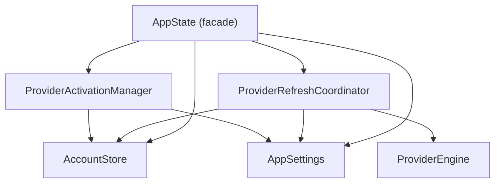
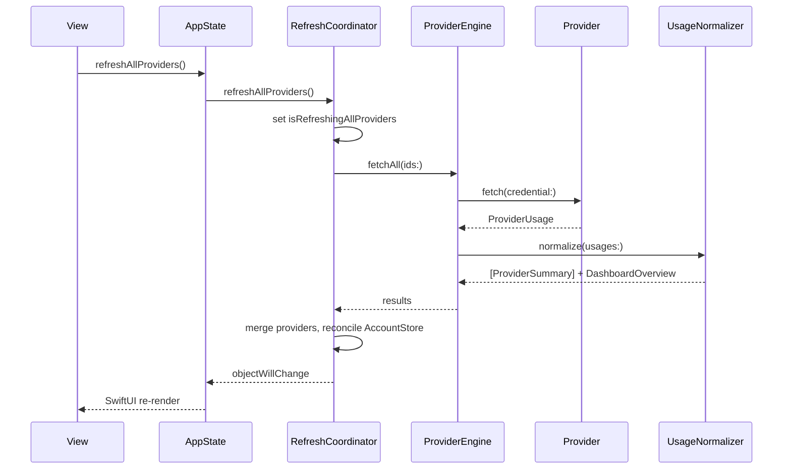

# AIUsage Architecture

## Overview

AIUsage is a macOS-native SwiftUI application that monitors AI subscription quotas across multiple providers, with an integrated Claude Code proxy for using third-party models. The codebase consists of two main modules: the **AIUsage app** (SwiftUI frontend + state management) and the **QuotaBackend** SwiftPM package (provider engines, normalizers, proxy runtime).

## Directory Structure

```
AIUsage/
├── AIUsageApp.swift              # @main, scene setup, EnvironmentObject wiring
├── Models/
│   ├── AppState.swift            # Thin facade: UI navigation + coordinator references
│   ├── AppSettings.swift         # UserDefaults-backed preferences (ObservableObject)
│   ├── AccountStore.swift        # Account registry & credential management
│   ├── ProviderModels.swift      # App-side ProviderData, alerts, etc.
│   ├── ProxyConfiguration.swift  # Proxy node config model (legacy, kept for compat)
│   └── NodeProfile.swift         # File-based node profile (_metadata + full settings.json)
├── Services/
│   ├── APIService.swift          # HTTP client for remote QuotaServer
│   ├── SecureAccountVault.swift  # Keychain read/write for account metadata
│   ├── ProviderAuthManager.swift # Auth flow orchestration (slim router)
│   └── ProviderAuth/
│       ├── ProviderAuthTypes.swift
│       ├── ProviderManagedImportStore.swift
│       ├── CLIExecutableResolver.swift
│       ├── CodexLoginCoordinator.swift
│       ├── GeminiLoginCoordinator.swift
│       ├── ProviderAuthCandidateDiscovery.swift
│       └── ProviderAuthParsing.swift
├── ViewModels/
│   ├── ProviderRefreshCoordinator.swift  # Refresh engine, timers, data pipeline
│   ├── ProviderActivationManager.swift   # CLI active account detection
│   ├── ProxyViewModel.swift              # Proxy node lifecycle & process management
│   ├── NodeProfileStore.swift            # File-based profile CRUD (~/.config/aiusage/profiles/)
│   └── ClaudeSettingsManager.swift       # ~/.claude/settings.json full write + backup/restore
└── Views/
    ├── ContentView.swift           # NavigationSplitView shell
    ├── DashboardView.swift         # Main dashboard
    ├── ProviderCard.swift          # Rich quota card UI
    ├── CostTrackingView.swift      # Token stats for Claude Code + Codex (per-source / All Sources)
    ├── ProxyManagementView.swift   # Proxy node list
    ├── ProxyStatsView.swift        # Proxy usage statistics
    ├── SettingsView.swift          # Preferences UI (sidebar navigation, 7 categories)
    ├── JSONRawEditorView.swift     # Raw JSON editor for node profiles
    ├── SettingsVisualEditorView.swift # Visual settings.json editor
    ├── ProfileExportView.swift     # Batch profile export UI
    └── ...

QuotaBackend/Sources/
├── QuotaBackend/
│   ├── ProviderProtocol.swift    # Core protocols & types
│   ├── Engine/
│   │   ├── ProviderEngine.swift          # Concurrent provider orchestration
│   │   ├── ProviderRegistry.swift        # Static provider list
│   │   ├── AccountCredentialStore.swift  # Keychain credential storage
│   │   └── BrowserDiscovery.swift        # Browser profile helpers
│   ├── Providers/
│   │   ├── ClaudeProvider.swift         # Local JSONL log scanner
│   │   ├── CodexProvider.swift          # OpenAI Codex API (multi-workspace)
│   │   ├── CodexCostProvider.swift      # Local Codex session JSONL scanner (+FileScanCache, +ArchiveStore)
│   │   ├── CopilotProvider.swift        # GitHub Copilot
│   │   ├── CursorProvider.swift         # Cursor IDE
│   │   ├── GeminiProvider.swift         # Google Gemini CLI
│   │   ├── AmpProvider.swift            # Amp
│   │   ├── DroidProvider.swift          # Droid (+API, +Auth, +Helpers, +Parsing)
│   │   ├── KiroProvider.swift           # Kiro (+Auth, +Parsing)
│   │   ├── WarpProvider.swift           # Warp
│   │   └── AntigravityProvider.swift    # Antigravity (multi-workspace)
│   ├── Normalizer/
│   │   ├── UsageNormalizer.swift        # Raw → ProviderSummary + DashboardOverview
│   │   ├── UsageNormalizer+<Provider>.swift  # Per-provider normalizers (11 files)
│   │   └── ProviderSummary.swift        # Normalized summary structs
│   ├── ClaudeProxy/
│   │   ├── Canonical/             # Unified middle layer (production pipeline)
│   │   ├── Runtime/               # Proxy service, upstream client
│   │   ├── Conversion/            # Legacy converters (reference impl)
│   │   ├── Models/                # API model definitions
│   │   └── Utilities/             # SSE encoder
│   └── Utilities/
│       └── DateFormatting.swift   # Shared formatters (SharedFormatters, DateFormat)
└── QuotaServer/
    ├── main.swift                          # CLI entry point
    ├── QuotaHTTPServer.swift               # NWListener HTTP server + StreamingResponse
    ├── QuotaHTTPServer+ClaudeProxy.swift   # Claude API routing & streaming bridge
    └── QuotaHTTPServer+Passthrough.swift   # Anthropic passthrough proxy
```

## Singleton Architecture



| Singleton | Responsibility |
|-----------|---------------|
| **AppState** | UI navigation state, selected providers, read-through forwarding, `objectWillChange` aggregation |
| **AppSettings** | UserDefaults-backed preferences: theme, language, refresh intervals, backend mode |
| **AccountStore** | Account registry, credential lifecycle, normalization/dedup, Keychain persistence |
| **ProviderRefreshCoordinator** | Refresh timers, `ProviderEngine` orchestration, local/remote fetch, data merging |
| **ProviderActivationManager** | CLI active account detection (Codex/Gemini), auth file I/O |

All singletons forward `objectWillChange` to `AppState`, so views observing `@EnvironmentObject var appState` refresh automatically.

## Data Flow: Provider Refresh



## Proxy Subsystem

详细架构文档见 [PROXY_ARCHITECTURE.md](PROXY_ARCHITECTURE.md)。

**Process lifecycle** (managed by `ProxyViewModel` + `ProxyRuntimeService`):

1. User activates a proxy node in the UI
2. `ProxyViewModel` executes transactional activation:
   - Loads full settings from `NodeProfileStore` profile (v0.5.0+) or legacy `ProxyConfiguration`
   - Writes complete `~/.claude/settings.json` via `ClaudeSettingsManager.writeFullSettings()` (with automatic backup to `settings.backup.json`)
   - Spawns `QuotaServer` process (via `ProxyRuntimeService`)
   - Writes pricing override
   - Persists `activatedConfigId` only after all steps succeed
3. Pipes stdout/stderr, parses `PROXY_LOG:` JSON lines for stats
4. On deactivation: kills process, restores `settings.json` from backup, rolls back state

**Proxy modes**:
- **OpenAI Convert**: Claude API → Canonical Middle Layer → OpenAI `chat/completions` or `responses` → upstream
- **Anthropic Passthrough**: Transparent forwarding with token usage logging

**Conversion pipeline**: All protocol conversion goes through a Canonical Middle Layer (see [CANONICAL_MIDDLE_LAYER_DESIGN.md](CANONICAL_MIDDLE_LAYER_DESIGN.md)).

## Storage Locations

| Location | Content |
|----------|---------|
| **UserDefaults** | App preferences, selected providers, stats |
| **Keychain** (`SecureAccountVault`) | Account registry metadata (emails, notes, IDs) |
| **Keychain** (`AccountCredentialStore`) | Provider credentials (cookies, tokens, API keys) |
| `~/.config/aiusage/profiles/*.json` | Node profile files (`_metadata` + full `settings.json` content) |
| `~/.claude/settings.json` | Claude Code configuration (full replacement on activation) |
| `~/.claude/settings.backup.json` | Backup of `settings.json` before activation |
| `~/.config/aiusage/proxy-logs.json` | Proxy request logs (with day-based retention) |
| `~/.config/aiusage/proxy-pricing.json` | Model pricing overrides |
| `~/.config/claude/projects/**/*.jsonl` | Claude Code usage logs (read-only by ClaudeProvider) |
| `~/.codex/sessions/**/*.jsonl`, `~/.codex/archived_sessions/**/*.jsonl` | Codex session logs (read-only by CodexCostProvider; overridable via `$CODEX_HOME`) |
| `~/Library/Caches/AIUsage/codex-cost-file-cache-v*.json` | CodexCostFileScanCache — per-file scan results, keyed on size + mtime so reopened sessions skip re-parsing |
| `~/Library/Caches/AIUsage/codex-cost-usage-archive-v*.json` | CodexUsageArchiveStore — rolled-up per-day token totals so the `.all` view can stretch beyond the 30-day live scan window |

## Supported Providers

| ID | Provider | Channel | Auth Method |
|----|----------|---------|-------------|
| codex | Codex (OpenAI) | CLI | `codex login` flow |
| copilot | GitHub Copilot | IDE | Browser session / gh CLI |
| cursor | Cursor | IDE | Browser session |
| antigravity | Antigravity | IDE | Browser session |
| kiro | Kiro | IDE | Auth file |
| warp | Warp | IDE | Auth file |
| gemini | Gemini CLI | CLI | Google OAuth |
| amp | Amp | CLI | Browser session |
| droid | Droid | CLI | Browser session / API |
| claude | Claude Code | Local | JSONL log scan (`~/.config/claude/projects`) |
| codex-cost | Codex Logs | Local | JSONL log scan (`~/.codex/sessions` + archived sessions, full-history import on demand) |

## CI/CD

Single GitHub Actions workflow (`.github/workflows/release.yml`):
- **Trigger**: push tag `v*.*.*` or manual dispatch
- **Steps**: checkout → validate version consistency (Info.plist + project.pbxproj + tag) → SPM resolve → build release → sign with Sparkle → upload DMG/ZIP → publish GitHub Release → update appcast.xml

**Version must match in three places**: `Info.plist` (CFBundleShortVersionString + CFBundleVersion), `project.pbxproj` (MARKETING_VERSION), and Git tag.

## Settings UI Architecture (v0.5.1+)

The `SettingsView` uses a **sidebar navigation + content area** two-column layout with 7 categories:

| Category | Content |
|----------|---------|
| **General** | Language, theme, display currency, launch at login, hide dock icon |
| **Data & Refresh** | Backend mode (local/remote), remote server config, provider/CC auto-refresh intervals |
| **Menu Bar** | Quota account pinning, cost source pinning + per-source config |
| **Card Appearance** | Quota card style (bar/ring/segments), progress meaning (remaining/used), preview |
| **Proxy** | Auto-start proxy on launch, proxy log retention |
| **Notifications** | Enable notifications, low quota alert threshold, Claude Code daily cost alert |
| **About** | Version, automatic updates, check for updates, GitHub link |

Menu bar display is hardcoded to `iconAndMetric` mode with `both` (quota% + cost) metric type. The settings sidebar navigation state is managed by a `SettingsCategory` enum.
