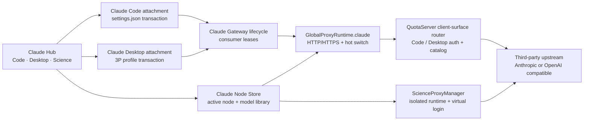

# Claude Desktop 一键接入 · 产品、交互与技术实施总纲

> 本文件是 AIUsage「Claude Desktop 3P 接入」的唯一规划与实施状态来源。架构决策、UX、阶段计划、TODO、验收证据和进度日志都在本文件维护；不要再创建内容重复的平行规划文档。

| 项目 | 当前值 |
|---|---|
| 需求来源 | [Issue #50](https://github.com/sylearn/AIUsage/issues/50) 及维护者补充说明 |
| 当前阶段 | `0.15.0 released / post-release compatibility follow-up` |
| 当前里程碑 | `P6：0.15.0 已发布` |
| 当前进行中的任务 | 无；下一项为 `CD-205` consumer 4-state 回归 |
| 最后更新 | 2026-07-21 |
| 支持平台首期 | macOS |

## 0. 防止上下文丢失的执行规则

以后任何会话继续本功能时，必须按下面顺序恢复上下文：

1. 先读本文件的「当前结论」「不可破坏的架构边界」「Current Focus」和「Master TODO」。
2. 再读即将修改的真实源码，不依赖历史对话推断现状。
3. 开始任务前，把对应 TODO 标成 `DOING`，同时更新 Current Focus；同一时间只允许一个 `DOING`。
4. 完成任务后，必须写入验证命令、测试结果或可视化截图路径，再标成 `DONE`。
5. 发现 Claude Desktop 版本行为与本文假设不同，先更新「兼容性事实表」和 ADR，再继续编码。
6. 架构或数据格式发生变化时直接修改本文对应章节；不要只在 commit、Issue 评论或对话里留下决定。
7. 禁止在未获得真实 Claude Desktop 请求证据时，把 UI 状态标成“已连接”。

状态定义：

- `TODO`：尚未开始。
- `DOING`：当前唯一进行中的任务。
- `PARTIAL`：主体已经实现或已有部分证据，但尚未满足该项全部退出条件。
- `BLOCKED`：已有明确阻塞条件，并已记录解除条件。
- `DONE`：实现、回归和验收证据齐全。

## 1. 当前结论

### 1.1 需求的准确含义

本需求不是把 Claude Science 的虚拟 OAuth、cookie、nonce 或 runtime hijack 原样搬到 Claude Desktop，也不是让用户再录入一套 Claude Desktop provider。

真正目标是：

> 用户已经在 AIUsage 的 Claude Code 代理节点中配置好第三方模型、协议转换、模型别名和模型库。AIUsage 应当把同一个活动节点一键部署为 Claude Desktop 官方 3P Gateway，让 Claude Desktop 使用该节点，同时获得统一 HTTPS 入口、安全回滚、可验证状态和独立用量归因。

因此主按钮应表达为「连接 Claude Desktop」或「应用并重新打开」，而不是「伪造登录」「免验证登录」或「接管账号」。Claude Desktop 官方 3P 模式本身就是产品允许的第三方推理入口；AIUsage 负责把它配置正确、路由正确并证明请求确实经过 AIUsage。

### 1.2 产品结论

- Claude Code、Claude Desktop、Claude Science 都属于 Claude 产品生态，侧边栏应合并为一个 `Claude` 菜单。
- 合并的是信息架构和视觉入口，不是强行合并三种运行机制。
- Claude Code 与 Claude Desktop 共享同一个 Claude 节点池、活动节点、代理进程和热切换链路。
- Claude Desktop 有独立的 3P profile、client key、路由表、配置事务和 `client_surface=desktop` 归因。
- Claude Science 继续使用独立端口、独立 QuotaServer、虚拟登录和独立 daemon 生命周期；只在 Claude Hub 中作为第三个 Tab 呈现。
- 首期只做 AIUsage 管理的本地 Gateway 模式。暂不增加“Desktop 直连第三方 provider”这一条重复且更难回滚的配置路径。

选择本地 Gateway 而不是同时提供 Direct/Mapping 两套主流程，是因为用户的节点可能是任意第三方模型或协议；统一经过 AIUsage 才能保证协议转换、模型别名、热切换、用量归因和脱敏诊断全部有效。以后可以为原生 Anthropic provider 增加“直连”高级模式，但它不能成为首期一键体验的分叉条件。

### 1.3 一句话架构

```text
Claude 节点池（唯一真相）
  ├─ Claude Code 配置消费者 ─┐
  └─ Claude Desktop 3P 消费者 ├─ 共享 Claude Gateway / 活动节点 / 热切换 / 统计
                               └─ 第三方 Anthropic 或 OpenAI 兼容上游

Claude Science 消费者 ─ 独立 Science Gateway / daemon / 虚拟登录 ─ 同一 Claude 节点池
```

## 2. 目标与非目标

### 2.1 用户目标

1. 选择一个现有 Claude 代理节点。
2. 点击一次「连接 Claude Desktop」。
3. AIUsage 完成网关启动、3P profile 写入、Claude Desktop 退出与重新打开。
4. Claude Desktop 的模型菜单显示可理解的模型名称，不暴露不被 Desktop 接受的上游原始 ID。
5. 切换 AIUsage 活动节点后，Claude Code 与 Desktop 同时无感切换，不必反复改 profile。
6. UI 能区分“配置完成”“Desktop 已打开”“真实请求已验证”。
7. 断开时恢复用户连接前的 profile 与 deployment mode，不影响其它配置工具管理的条目。
8. 请求在调用分析、费用统计和日志中明确标记来源为 Claude Desktop。
9. Desktop HTTPS 端口属于产品级连接设置，所有节点共用；不再要求用户逐节点配置 HTTPS。

### 2.2 非目标

- 不读取、复制、导出或伪造 Anthropic 官方账号 token、cookie、OAuth refresh token。
- 不把 Claude Science 的虚拟登录文件写入 Claude Desktop 数据目录。
- 不修改系统全局代理。
- 不让局域网默认访问 Desktop Gateway。
- 不自动执行全局 `claude auth logout`。
- 不覆盖用户已有的整个 `_meta.json`、`claude_desktop_config.json` 或其它工具的 profile。
- 不把用户的真实第三方 API key直接写入 Desktop profile；profile 只保存 AIUsage 本地 client key。
- 不用一次付费推理调用冒充“健康检查”。
- 首期不支持 Windows；数据模型和路径解析接口需为后续 Windows 留出边界。

## 3. 三个 Claude 产品面的能力边界

| 产品面 | 客户端入口 | 本地身份机制 | AIUsage 应做什么 | 是否共享 Claude Gateway |
|---|---|---|---|---|
| Claude Code | `~/.claude/settings.json` | 固定 `ANTHROPIC_AUTH_TOKEN` | 写入/还原受管环境、热切换节点 | 是 |
| Claude Desktop | 官方 3P profile | Gateway bearer；不同版本可能受 Desktop 内置 OAuth 状态影响 | 原子部署 profile、重启、验证、回滚 | 是 |
| Claude Science | 独立 daemon + browser/app | AIUsage 自有虚拟 OAuth、nonce/cookie 反代 | 沙箱或 adopt、免登录入口、独立生命周期 | 否 |

关键边界：

- Desktop 是“官方 Gateway 配置部署”，Science 是“独立应用运行时桥接”。
- Desktop 不需要 Science 的登录伪造；Science 也不能复用 Desktop profile。
- Code 与 Desktop 共用上游是为了用户一致性；两者的客户端配置和鉴权必须相互隔离。

## 4. 调研基线与可复核事实

### 4.1 Issue #50 与维护者澄清

Issue #50 将目标描述为类似 Science 的 one-click authorized path，并要求健康探测、脱敏诊断和安全回滚。维护者随后明确：核心不是 Claude Science 式“免登录”，而是把 AIUsage Claude Code 节点中的任意第三方模型一键配置给已经支持 3P 的 Claude Desktop。

本方案以维护者澄清后的目标为准，同时保留 Issue 中正确的质量要求：一键、可证明、可回滚、可诊断。

### 4.2 当前本机 Claude Desktop 事实快照

2026-07-21 只读核验：

- App bundle：`com.anthropic.claudefordesktop`
- 版本：`1.12603.1`
- 3P 根目录：`~/Library/Application Support/Claude-3p/`
- 3P live config：`Claude-3p/claude_desktop_config.json`
- profile 元数据：`Claude-3p/configLibrary/_meta.json`
- profile 文件：`Claude-3p/configLibrary/<UUID>.json`
- 当前 `_meta.json` 顶层字段为 `appliedId`、`entries`；entry 字段为 `id`、`name`。
- 本机 Gateway profile 可见字段包括 `inferenceProvider`、`inferenceGatewayBaseUrl`、`inferenceGatewayApiKey`、`inferenceModels`、`disableDeploymentModeChooser`。
- 本机 `inferenceModels` 是对象数组，已观察到 `name` 与可选 `supports1m`。
- 普通目录和 `Claude-3p` 目录各有一份 `claude_desktop_config.json`；启用 3P 时 `deploymentMode=3p`。

这只是当前版本事实，不是永久 API；P0 必须把它固化为脱敏 fixture 和版本能力探测。

### 4.3 参考实现

#### CC Switch

参考：

- [Claude Desktop 用户手册](https://github.com/farion1231/cc-switch/blob/main/docs/user-manual/en/2-providers/2.6-claude-desktop.md)
- [`claude_desktop_config.rs`](https://github.com/farion1231/cc-switch/blob/main/src-tauri/src/claude_desktop_config.rs)
- [Claude Desktop 401 / route 不一致问题 #2865](https://github.com/farion1231/cc-switch/issues/2865)

值得复用的思想：

- 把 Claude Desktop 作为独立一等产品面。
- 使用稳定 profile ID，只合并自己的 `_meta.json` entry。
- 写入前快照四个关键文件，失败时按原始字节回滚。
- 对 Desktop 暴露安全的 `claude-sonnet-* / claude-opus-* / claude-haiku-*` route，真实上游模型只留在本地路由器。
- `labelOverride` 与 `supports1m` 属于展示/能力声明，不应改变真实路由身份。
- 配置完成后明确要求完全重启 Desktop。

不能照搬的部分：

- CC Switch 的“恢复官方模式”会倾向写回 `1p`；AIUsage 应恢复连接前的精确状态，而不是假设连接前一定是官方模式。
- 其本地 Gateway 使用单独开关；AIUsage 已有 Claude 常驻网关，不应再启动第二套重复代理。
- Issue #2865 仍显示部分新版 Desktop 在 `claude-desktop-3p` entrypoint 下可能发送 host-managed bearer，而非 profile 中的 token。AIUsage 不能只验证“配置文件 token 与本地数据库 token 相同”，必须验证真实 Desktop 请求。

#### cc-desktop-switch

参考：[`lonr-6/cc-desktop-switch`](https://github.com/lonr-6/cc-desktop-switch/tree/main)。

值得复用的思想：

- 只向 Desktop 暴露安全 route；真实模型 ID 与 provider 保留在本地映射层。
- 对 dated Haiku、稳定别名和 `supports1m` 做显式兼容。
- 配置管理有独立备份目录，模型映射可独立回归。

不能照搬的部分：该项目自建 provider 数据源和 Python Gateway，AIUsage 已有 Swift 节点模型、QuotaServer 与统计链路，应复用现有架构。

#### Ollama Claude Desktop launcher

参考：[`ollama/cmd/launch/claude_desktop.go`](https://github.com/ollama/ollama/blob/main/cmd/launch/claude_desktop.go)。

值得复用的思想：

- 固定 profile ID；合并 deployment mode、meta entry 和 Gateway profile。
- 写入采用带备份的文件更新。
- 检测 Desktop 是否运行；询问并完成完整退出/重启，而不是只关窗口。
- 通过读取实际 applied ID、deployment mode、base URL 和 key 是否存在判断“配置是否匹配”。

注意：Ollama 当前源码已把 Claude Desktop integration 标记为不再支持，不能把它作为当前兼容性保证；这里只参考文件事务和进程交互。

### 4.4 调研得出的硬性门禁

在进入正式实现前必须回答：

1. 当前 Claude Desktop `1.12603.1` 会将 profile base URL 拼成哪个实际请求路径？
2. Code、Cowork、Chat 三个模式是否都走同一个 Gateway？
3. Desktop 实际发送 profile bearer，还是 first-party/host-managed bearer？
4. 用户已经登录官方账号时，3P Code entrypoint 是否覆盖 profile token？
5. 修改 `inferenceModels` 后必须重启还是会热刷新？
6. `labelOverride`、`supports1m`、`[1m]` 后缀在当前版本的真实行为是什么？
7. HTTP loopback、AIUsage HTTPS 和证书信任分别是否可用？
8. `coworkEgressAllowedHosts` 的最小安全集合是什么？是否真的需要 `*`？

这些问题没有实证前，相关 ADR 保持 `PROVISIONAL`，不得假装已经确定。

## 5. 现有 AIUsage 架构基线

| 现有模块 | 当前职责 | Desktop 复用方式 | 当前缺口 |
|---|---|---|---|
| `Models/GlobalProxyConfig.swift` | Claude 固定端口、client key、三档虚拟模型、活动节点和持久化 | 继续作为共享 Gateway 配置 | `isEnabled` 只有一个 owner，不能表达 Code/Desktop 两个消费者 |
| `ViewModels/GlobalProxyTrackAdapters.swift` | Claude 节点筛选、上游 env、热切换 payload、Code settings 写入 | 复用节点筛选和上游投影 | Desktop 不能调用 `activateCLIConfig`；模型目录尚未进入普通 Claude 轨 |
| `ViewModels/GlobalProxyManager.swift` | 启停、热切换、配置接管/还原 | 升级为多消费者生命周期 | `disable()` 会无条件停 runtime，不支持 Desktop 仍连接 |
| `Services/GlobalProxyRuntime.swift` | 固定端口 QuotaServer、健康检查、admin 热切换、日志归因 | 直接复用 Claude runtime | 未注入 TLS；日志只有 node_id，没有 client surface |
| `QuotaBackend/.../ClaudeProxyConfiguration.swift` | 第三方上游、Code client key、三档映射、Science catalog | 扩展为通用 Claude 客户端目录/鉴权 | `exposeScienceModelCatalog` 命名与行为绑定 Science |
| `QuotaBackend/.../QuotaHTTPServer.swift` | `/v1/messages`、count_tokens、files、models、admin route | 增加 Desktop client surface 归一 | `/v1/models` 目前只在 Science catalog 开关下暴露 |
| `ViewModels/ScienceProxyManager.swift` | 复用 Claude 节点池，独立 runtime、catalog、daemon 与虚拟登录 | 复用其节点目录构造经验 | 不与 Desktop 共用 lifecycle |
| `Services/ProxyRuntimeService.swift` | 每节点代理进程、HTTP/HTTPS 启动 | 复用 TLS 启动契约 | Global runtime 还不能启用 HTTPS |
| `Services/TLSCertificateManager.swift` | 本地 CA、localhost/127.0.0.1 SAN、PKCS12 | 复用现有证书链 | 首次信任可能触发管理员授权，不能偷偷弹窗 |
| `Views/SidebarNavigation.swift` | Claude Code 与 Science 两个平铺入口 | 合并为 Claude Hub | 隐藏状态和旧选中 section 需要迁移 |

现有优势：

- Claude 节点已覆盖 Anthropic passthrough 与 OpenAI compatible convert。
- big/middle/small 模型映射、模型库、计价和 node_id 统计已经存在。
- QuotaServer 已有 `/v1/messages`、`/v1/messages/count_tokens`、Files API 与 `/v1/models` 基础能力。
- admin 热切换已经能原子替换上游，Desktop 无需跟随节点切换重写 profile。
- Science 已验证“当前节点模型库 → 安全客户端目录 → 精确真实模型”的基本路径。

## 6. 目标架构

### 6.1 组件关系



### 6.2 共享 Gateway 生命周期

引入持久化消费者集合：

```swift
enum ClaudeGatewayConsumer: String, Codable, CaseIterable {
    case code
    case desktop
}

struct ClaudeGatewayActivation: Codable, Equatable {
    var consumers: Set<ClaudeGatewayConsumer>
    var activeNodeId: String?
}
```

生命周期不变量：

```text
gatewayShouldRun = consumers contains code OR consumers contains desktop
```

- Code 启用：启动 Gateway（如尚未运行）→ 写 Code settings → 添加 `.code`。
- Desktop 连接：启动 Gateway（如尚未运行）→ 写 Desktop profile → 添加 `.desktop`。
- Code 停用：还原 Code settings → 删除 `.code`；只有集合为空才停 Gateway。
- Desktop 断开：恢复 Desktop profile → 删除 `.desktop` → 关闭 Desktop HTTPS listener → 退出正在运行的 Desktop 但不重新打开；只有集合为空才停 Gateway。
- 切换节点：共享 `activeNodeId`，Code 与 Desktop 同时切换。
- 任一消费者配置失败：只回滚该消费者，不影响另一个已经工作的客户端。

兼容迁移：旧 `global-proxy-claude.json` 中 `isEnabled=true` 迁移为 `consumers=[code]`；旧 UI 的 `isEnabled` 暂保留为 `.code` 的计算语义，避免一次性改动全部调用点。

### 6.3 客户端 surface 与路由归一

QuotaServer 内部先把请求归一为：

```swift
enum ClaudeClientSurface: String, Sendable {
    case code
    case desktop
    case science
}

struct NormalizedClaudeRoute {
    let surface: ClaudeClientSurface
    let canonicalPath: String
    let originalPath: String
}
```

目标端点至少覆盖：

| Canonical endpoint | Code | Desktop | 说明 |
|---|---:|---:|---|
| `POST /v1/messages` | 是 | 是 | 非流式/流式主链路 |
| `POST /v1/messages/count_tokens` | 是 | 是 | token 预估 |
| `GET /v1/models` | 可选 | 是 | Desktop 模型目录 |
| `GET/POST/DELETE /v1/files...` | 是 | 按实测 | Files API |
| `POST /api/event_logging/batch` | 是 | 按实测 | 本地快速成功，不上传敏感遥测 |

Desktop base URL 合同由 P0 决定，路由层必须能兼容：

- `root`：profile 指向 `https://localhost:<port>`，客户端请求 `/v1/...`。
- `prefixed`：profile 指向 `https://localhost:<port>/claude-desktop`，客户端请求 `/claude-desktop/v1/...`。

即使最终 profile 只写一种，服务端也应保留两种 route adapter，避免 Desktop 小版本改变拼接行为后全量失效。query（如 `beta=true`）必须原样保留。

### 6.4 鉴权设计

Code 与 Desktop 使用不同 client key：

| Surface | 预期凭据 | 用途 |
|---|---|---|
| Code | 现有 `GlobalProxyConfig.clientKey` | settings.json 的固定 token |
| Desktop | 独立随机 256-bit key | 3P profile 的 `inferenceGatewayApiKey` |
| Science | 无固定 client key；只监听回环并剥离虚拟 OAuth | 保持现状 |

规则：

- client surface 由匹配成功的路径/凭据决定，不信任客户端自报 header。
- 入站 Authorization 和 x-api-key 一律不转发上游。
- Desktop key 不复用上游 key，不打印原文，只记录短哈希指纹。
- 未知 bearer 默认 fail closed；不能因为监听回环就长期接受任意 token。
- 首期禁止自动清除全局 Claude Code OAuth 或官方 Claude 账号。
- 如果当前 Desktop 确认存在 host-managed bearer 覆盖，优先提供可解释的诊断和显式修复流程；任何“捕获并信任第一个未知 token”的 pairing 方案必须单独通过安全评审，不能暗中上线。

### 6.5 Desktop 模型目录

唯一模型来源是当前活动节点：

```text
node.modelLibrary
  └─ 空时才回退 defaultModel + big/middle/small
      └─ ClaudeDesktopModelCatalogBuilder
          ├─ safe route id
          ├─ labelOverride
          ├─ supports1m
          └─ exact upstream model
```

当前实现的 route 合同（已对照本机 Claude Desktop 1.12603.1 的实际校验器）：

| 上游模型 | Desktop Model ID | Display name |
|---|---|---|
| 已合规 Anthropic ID | 保留原 ID，例如 `claude-sonnet-4-6` | 原上游 ID |
| 第三方大模型/Opus 语义 | `claude-opus-4-6-aiusage-v1-<decimal hash>` | 原上游 ID |
| 第三方小模型/Haiku 语义 | `claude-haiku-4-6-aiusage-v1-<decimal hash>` | 原上游 ID |
| 其它第三方模型 | `claude-sonnet-4-6-aiusage-v1-<decimal hash>` | 原上游 ID |

规则：

1. Desktop 只看到安全 `claude-*` route；GPT、Kimi、DeepSeek、Codex 等真实 ID 不进入 Model ID。
2. 真实 ID只存在于 AIUsage 节点和运行时映射。
3. 1.12603.1 的校验器会先拒绝 Model ID 中的第三方标记（包括 `codex`、`gpt`、`gemini`、`glm`、`qwen`、`deepseek` 等），再判断 Claude/Anthropic 形态。因此生成 ID 绝不能拼入 upstream slug；十进制稳定哈希避免哈希文本偶然命中黑名单词。
4. profile 的 `labelOverride` 与 `/v1/models` 的 `display_name` 都使用真实上游 ID；Model ID 只承担路由身份。
5. `supports1m` 是“节点 + 真实上游模型”维度的显式用户设置，默认 false；同时写入 profile 与 `/v1/models`，不根据模型名猜测。
6. 活动节点切换或 1M 开关变化时，Gateway route map 与 AIUsage profile 使用同一 catalog builder 刷新，避免两份目录漂移。
7. 模型目录和 Science 共享“来源规则”，不共享具体 transport alias，避免两个客户端缓存语义相互污染。

### 6.6 HTTPS 策略

推荐默认：`https://localhost:<Claude gateway HTTPS port>`；证书复用 `TLSCertificateManager` 现有 CA 与 localhost SAN。

首期端口布局建议：

| Listener | 默认端口 | 消费者 |
|---|---:|---|
| Claude Gateway HTTP | 14400 | Claude Code 与内部 health/admin |
| Claude Gateway HTTPS | 14403 | Claude Desktop 3P Gateway |

两个 listener 由同一个 QuotaServer 进程提供。HTTPS 不能机械使用 `HTTP port + 1`：14401 已是 OpenCode 默认端口，14402 已是 Science 推理代理端口。14403 必须纳入 `ProxyPortArbiter`、启动冲突检测和运行时 owner 列表。

端口所有权与迁移规则：

1. `GlobalProxyConfig.claudeDesktopHTTPSPort` 是唯一 Desktop HTTPS 端口真相，默认 `14403`，所有 Desktop 节点共用。
2. Desktop 页面使用独立的 `Desktop HTTPS 端口` 卡片与标准输入框，不能把可编辑数字藏在 URL 中间；完整地址、安全边界和断开行为收进右上角问号弹层。
3. 已接入时禁止静默改端口；用户先断开，保存后在下次接入生效，避免当前 Desktop 会话突然失联或被强制重启。
4. Claude 节点编辑器不再展示“每节点 HTTPS / HTTPS 端口”。新节点默认关闭旧 listener；编辑旧节点时迁移到 HTTP-only 本地节点合同。
5. `enableHTTPS` / `httpsPort` 仍保留 Codable 与旧运行时兼容，避免旧档案解码失败；它们不再是 Desktop 配置来源，后续在独立 schema migration 中删除。

分级策略：

1. 已存在且受信任的 AIUsage CA：静默使用 HTTPS。
2. 首次需要建立信任：在 UI 明示“将安装 AIUsage 本地证书”，由用户点击确认后触发系统授权。
3. 用户拒绝或当前 Desktop 不接受该证书：只有 P0 证明 loopback HTTP 可用时，才显示“仅本机 HTTP”降级选项。
4. 无论 HTTP/HTTPS，默认只绑定 `127.0.0.1`；Desktop 页面不继承 Claude Code 的“允许局域网”开关。
5. profile 使用 `localhost` 以匹配证书 SAN；内部 health/admin 仍用 `127.0.0.1` HTTP，不暴露给 Desktop。

GlobalProxyRuntime 需要复用 `ProxyRuntimeService` 已有环境变量契约：`ENABLE_HTTPS`、`TLS_IDENTITY_PATH` 与 `HTTPS_PORT`，不能新造第二套证书系统。

### 6.7 统计与诊断归因

每条代理日志增加：

```json
{
  "node_id": "...",
  "client_surface": "claude_desktop",
  "requested_model": "claude-sonnet-4-6",
  "upstream_model": "kimi-k2.5"
}
```

要求：

- 费用仍按 node.modelLibrary 的真实 upstream model 计价。
- 调用分析可筛选 `Claude Code / Claude Desktop / Claude Science`。
- Desktop 的 auth/profile/route 错误分别给出 stage：`preflight`、`gateway`、`profile-write`、`restart`、`auth-observed`、`model-route`、`upstream`、`rollback`。
- 日志不能包含 API key、bearer、cookie、session ID、profile 完整 JSON 或用户消息正文。

## 7. Claude Desktop 配置事务

### 7.1 AIUsage 自有 profile

- 稳定 profile ID：实现时生成固定 UUID，并写入常量；一经发布不得更换。
- profile name：`AIUsage Gateway`，避免随节点名变化导致 `_meta.json` churn。
- profile base URL：指向共享 Claude Gateway 的 Desktop surface。
- profile key：只保存 AIUsage Desktop client key。
- profile models：只保存安全 route、label 和显式 capability。

示意，不是最终兼容性合同：

```json
{
  "inferenceProvider": "gateway",
  "inferenceGatewayBaseUrl": "https://localhost:14403/claude-desktop",
  "inferenceGatewayAuthScheme": "bearer",
  "inferenceGatewayApiKey": "<AIUsage Desktop client key>",
  "disableDeploymentModeChooser": true,
  "inferenceModels": [
    {
      "name": "claude-sonnet-4-6",
      "labelOverride": "Kimi K2.5",
      "supports1m": false
    }
  ]
}
```

字段以 P0 当前版本 fixture 为准；未知字段必须保留，不能按示例整文件覆盖。

### 7.2 受事务保护的文件

```text
~/Library/Application Support/Claude/claude_desktop_config.json
~/Library/Application Support/Claude-3p/claude_desktop_config.json
~/Library/Application Support/Claude-3p/configLibrary/_meta.json
~/Library/Application Support/Claude-3p/configLibrary/<AIUsage profile ID>.json
```

### 7.3 写入协议

1. Preflight：版本、安装路径、目录权限、JSON 类型、managed/enterprise 状态、端口、证书、活动节点和模型目录。
2. 获取 AIUsage 自有 advisory lock；检测是否有未完成 journal。
3. 逐文件保存“存在性 + 原始字节 + 权限 + SHA-256”，不是重新序列化后的 JSON。
4. 将 durable journal 写到 `~/.config/aiusage/claude-desktop/restore-state.json`，权限 `0600`。
5. 只合并受管字段；保留全部未知字段和其它 `_meta.entries`。
6. 使用同目录临时文件、fsync、atomic rename 写入；设置合理权限。
7. 重新读取并做 schema 与期望值校验。
8. journal 标记 `profileCommitted`。
9. 按用户选择重启/打开 Claude Desktop。
10. Gateway 记录到真实 Desktop 请求后标记 `trafficVerified`；未观察到请求时只显示 Ready。

任一步写入或校验失败：按快照恢复全部文件，并重新读取确认哈希一致。

### 7.4 断开与外部修改冲突

- 连接前记录 `previousAppliedId` 和两处 `deploymentMode`。
- 断开时恢复连接前精确状态，不默认切到 `1p`。
- 如果用户/其它工具在 AIUsage 连接后把 `appliedId` 改成别的 profile，AIUsage 不抢回控制权；显示“配置已被其它工具修改”。
- 此时断开只移除/恢复 AIUsage 自有 profile 和能够确认仍由 AIUsage 管理的字段，不覆盖当前第三方 profile。
- `_meta.json` 中同 ID 的 AIUsage entry 去重；其它 entry 保序保内容。
- 检测 MDM/enterprise managed 配置时 fail closed，展示管理员策略说明，不尝试绕过。
- App 崩溃后下次启动先恢复/完成 journal，再启动 Gateway。

## 8. Claude Desktop 进程与状态机

### 8.1 进程操作

- 安装检测首选 bundle ID，路径兼容 `/Applications/Claude.app` 与 `~/Applications/Claude.app`。
- 使用 `NSRunningApplication` 查找和正常 terminate；等待进程退出，默认不 SIGKILL。
- Desktop 未运行：应用配置后直接打开。
- Desktop 正在运行：主按钮显示「应用并重新打开」；点击前提示可能中断当前任务。
- 正常退出超时：保留已验证的配置，显示“请手动完全退出后重试”，同时提供显式回滚按钮。
- 重新打开失败：不谎报已连接；展示 Finder 中的 app 路径和重试。

### 8.2 状态机

```text
Unavailable
  └─> NotConnected
       └─ connect ─> Preflighting
                      └─> StartingGateway
                           └─> WritingProfile
                                └─> RestartingDesktop
                                     └─> ReadyAwaitingTraffic
                                          └─ first real request ─> Connected

任何阶段失败 ─> RollingBack ─> NotConnected / NeedsAttention
Connected ─ disconnect ─> RestoringProfile ─> NotConnected
```

状态文案必须精确：

| 内部状态 | 用户看到 | 含义 |
|---|---|---|
| `notConnected` | 未连接 | 未应用 AIUsage profile |
| `readyAwaitingTraffic` | 已接入 | profile 与本机 HTTPS 端口正常，但本次 AIUsage 启动后尚未观察到真实 Desktop 流量 |
| `connected` | 已连接到 AIUsage | 已观察到通过 Desktop surface 的真实请求 |
| `needsAttention` | 需要处理 | 配置漂移、鉴权冲突、证书或版本不兼容 |
| `rollingBack` | 正在恢复原配置 | 正在按快照还原 |

“Gateway 自己能访问自己”只能证明服务就绪，不能将状态升级为 `Connected`。

启动恢复合同：只要 AIUsage 管理的 Desktop profile 仍处于接入状态，启动时就必须恢复其 localhost HTTPS listener；该恢复不受通用 CLI“启动时恢复代理”开关影响。若端口恢复失败，状态必须进入 `needsAttention`，不能只凭 profile 存在显示“已接入”。`Connected` 是本次运行期流量证据，不跨进程持久化，但流量监听必须覆盖整个接入生命周期，不能只等待启动后的短时间窗口。

## 9. 最佳交互与视觉方案

### 9.1 导航：合并为 Claude Hub

侧边栏原来的：

```text
Claude Code
Claude Science
```

调整为：

```text
Claude
```

详情页顶部使用三个等宽产品按钮，不使用系统 segmented picker：

```text
[ terminal  Code        ] [ window  Desktop     ] [ atom  Science       ]
[           代理与节点  ] [       桌面端接入    ] [       研究工作台    ]
```

原因：用户的核心对象是 Claude 生态和同一组节点，而不是三套后台实现。Tab 保留各产品面的独立心智模型，避免把 Science 的“接管”误认为 Desktop 的“登录”。

迁移规则：

- 旧 `.proxyManagement` 导航到 Claude Hub 的 `Code` Tab。
- 旧 `.scienceProxyManagement` 导航到 `Science` Tab。
- 新 `.claudeHub` 是侧边栏唯一 entry。
- 旧隐藏状态中只要 Code 或 Science 任一项可见，迁移后 Claude Hub 默认可见；只有二者都隐藏时才隐藏 Hub。
- 深链、菜单栏跳转和设置页可见性都通过同一 `SidebarNavigation` 数据源。

### 9.2 页面层级

```text
┌──────────────────────────────────────────────────────────────────────┐
│ Claude        [ Code / 代理与节点 ][ Desktop / 桌面端接入 ][ Science ]│
│ 一套节点库 · Code、Desktop 与 Science                                │
│                                                                      │
│  Active Claude node                                                  │
│  ┌────────────────────────────────────────────────────────────────┐  │
│  │ SuCloud / Kimi K2.5                           Change node  ›    │  │
│  │ Anthropic → OpenAI · HTTPS · 3 mapped model roles              │  │
│  └────────────────────────────────────────────────────────────────┘  │
│                                                                      │
│  Claude Desktop                                                      │
│  ┌────────────────────────────────────────────────────────────────┐  │
│  │ ● Ready / Connected                                            │  │
│  │ Use this node in Claude Desktop through AIUsage.               │  │
│  │ Models: 29      1M enabled: 2      Kimi K2.5 · … · +26         │  │
│  │                                                                │  │
│  │ [ Connect Claude Desktop ]      [ Manage models ] [ Advanced ] │  │
│  └────────────────────────────────────────────────────────────────┘  │
│                                                                      │
│  Last Desktop request · 12s ago · 842 ms · Kimi K2.5                 │
└──────────────────────────────────────────────────────────────────────┘
```

### 9.3 交互原则

- 共享活动节点放在 Hub 顶部，不在 Code 和 Desktop 内各放一个会产生冲突的选择器。
- 当 Code 已运行时连接 Desktop，不再启动第二个 Gateway，只显示“将共享当前节点”。
- 当 Desktop 已连接时切换节点，确认文案明确“Claude Code 与 Desktop 将同时切换”。
- 默认视图只保留节点、状态、模型摘要、模型设置、主按钮和一个紧凑的 Desktop HTTPS 端口卡片。
- `HTTPS 端口`使用独立标签和标准输入框；正常状态不展示解释段落。endpoint、重启恢复语义、安全边界和断开行为统一放进问号弹层，用户需要时再查看。
- 主页面不展开完整模型长列表；数量和 1M 数量保持紧凑，前三个 Display name 改为独立全宽区域并允许两行展示。完整目录进入可搜索的“模型设置”sheet。
- 模型管理行以 Display name 为主标题、Model ID 为次级技术信息，并为每个真实上游模型提供独立的 `Offer 1M-context variant` 开关。
- 主按钮状态：`连接 Claude Desktop` → `正在连接…` → `断开并恢复`。
- 接入后必须完整退出并重新打开 Desktop，因为当前版本只在启动时读取 3P profile；断开时则恢复配置、关闭 HTTPS listener、退出 Desktop，但不再次打开。用户下次手动打开时读取已恢复配置。
- 错误卡片必须给出下一步动作，而不是只显示异常字符串。
- 共享路由在 profile 与端口恢复成功后即点亮 Desktop；状态徽标显示“已接入”。收到本次运行期第一条真实请求后再升级为“已连接”。
- 配置校验失败、Gateway 已连接但上游 4xx/5xx、以及模型/额度错误必须分层显示；收到 Desktop 请求即可判定本地连接成功，不能把上游 502 回退成“Desktop 未连接”。
- 允许复制脱敏诊断，禁止一键复制完整 profile 或 token。

### 9.4 视觉语言

- Claude Hub 使用 Claude 品牌暖陶土色作单一强调色；Science 的紫色只用于 Tab 内的 Science 状态，不在整页竞争。
- 背景使用系统分组材质与低对比边框，避免大面积高饱和渐变。
- 状态颜色只表达语义：绿=本次运行已验证真实流量，品牌陶土色=已接入等待流量，橙=需要动作，红=已失败并可能回滚。
- route 使用紧凑胶囊；Display name 使用独立全宽列表，避免把真实长模型名压缩成不可读的胶囊。
- “模型设置”是整行可点击的二级入口，不在主页面重复解释完整名称、Model ID 与 1M 上下文。
- 数值与端口使用 monospaced digit；普通说明不用等宽字体。
- 动画只用于状态切换和进度，不做持续脉冲。
- 支持浅色、深色、增大对比度、Reduce Motion 和完整键盘焦点顺序。

### 9.5 关键文案

成功：

```text
Claude Desktop 已配置完成
AIUsage 已应用本地 Gateway，并重新打开 Claude Desktop。发送第一条消息后，这里会确认实际连接。
```

鉴权冲突：

```text
Claude Desktop 没有使用 AIUsage 配置的访问凭据
本地 Gateway 已收到请求，但凭据来自另一套登录状态。AIUsage 没有修改你的官方账号。查看安全修复步骤…
```

外部配置变更：

```text
Claude Desktop 配置已由其它工具更改
AIUsage 不会覆盖当前 profile。你可以重新连接，或只移除 AIUsage 留下的配置。
```

## 10. 数据模型与新模块边界

### 10.1 建议新增数据

```swift
struct ClaudeDesktopIntegrationConfig: Codable, Equatable {
    var schemaVersion: Int
    var desiredConnection: Bool
    var clientKey: String
    var profileID: String
    var routeContract: ClaudeDesktopRouteContract
    var transportSecurity: ClaudeDesktopTransportSecurity
    var lastVerifiedDesktopVersion: String?
    var lastTrafficAt: Date?
}
```

说明：

- `desiredConnection` 表达重启后是否恢复，不等于“当前已连接”。
- `lastTrafficAt` 只是 UI 快照；真实运行态从 Gateway 事件恢复。
- restore journal 与该配置分离，避免正常设置更新覆盖回滚证据。
- client key 文件必须 `0600`，日志只用指纹。未来可迁 Keychain，但 profile 本身仍需写入该 key，不能宣称绝对不可读。

### 10.2 建议新增模块

| 文件 | 职责 |
|---|---|
| `AIUsage/Services/ClaudeDesktop/ClaudeDesktopPaths.swift` | 平台路径、bundle/version 探测 |
| `AIUsage/Services/ClaudeDesktop/ClaudeDesktopProfileBuilder.swift` | profile 与 safe model route 构造 |
| `AIUsage/Services/ClaudeDesktop/ClaudeDesktopConfigTransaction.swift` | lock、snapshot、atomic write、journal、rollback、冲突检测 |
| `AIUsage/Services/ClaudeDesktop/ClaudeDesktopApplicationController.swift` | 退出、等待、打开与错误分类 |
| `AIUsage/ViewModels/ClaudeDesktopIntegrationManager.swift` | 状态机与一键流程编排 |
| `AIUsage/Models/ClaudeDesktopModelCatalog.swift` | 当前节点模型库到 Desktop route 的纯函数映射 |
| `AIUsage/Views/ClaudeHubView.swift` | Code/Desktop/Science Tab 容器与共享节点头部 |
| `AIUsage/Views/ClaudeDesktopIntegrationView.swift` | Desktop 状态、CTA、诊断与 Advanced |

### 10.3 需要修改的模块

| 文件 | 计划改动 |
|---|---|
| `AIUsage/Models/GlobalProxyConfig.swift` | Claude consumers schema 与旧 `isEnabled` 迁移 |
| `AIUsage/ViewModels/GlobalProxyManager.swift` | attach/detach consumer；最后一个 consumer 离开才停 runtime |
| `AIUsage/ViewModels/GlobalProxyTrackAdapters.swift` | 分离“上游投影”与“Code 配置写入”；暴露节点 catalog projection |
| `AIUsage/Services/GlobalProxyRuntime.swift` | HTTPS、surface 事件、运行态 lease 与日志归因 |
| `QuotaBackend/.../ClaudeProxyConfiguration.swift` | 通用 client auth/catalog，移除 Science 专属命名耦合 |
| `QuotaBackend/.../QuotaHTTPServer.swift` | Desktop route adapter、surface auth、models 与端点归一 |
| `QuotaBackend/.../QuotaHTTPServer+ClaudeProxy.swift` | safe catalog、model route、surface 日志 |
| `AIUsage/Models/AppSettings.swift` | `.claudeHub` 与旧 section 迁移 |
| `AIUsage/Views/SidebarNavigation.swift` | 合并 Claude entry |
| `AIUsage/Views/ContentView.swift` | Claude Hub 路由与旧入口兼容 |
| `AIUsage/ViewModels/ProxyViewModel+ProxyServer.swift` | 启动恢复顺序：journal → Gateway → consumers → Desktop status |
| 中英文 `Localizable.strings` | 全部可见文案与辅助功能标签 |

## 11. 不可破坏的架构边界

1. 节点真相只有一份：`ProxyViewModel.shared.configurations` 中的 Claude family 节点。
2. Code 与 Desktop 不能各自保存一份会漂移的上游 key/baseURL/model mapping。
3. Desktop profile 永远不保存真实上游 key。
4. Desktop 连接/断开不能无条件启停共享 runtime。
5. Science runtime 不能并入 Claude Code/Desktop runtime。
6. 模型 route 必须是稳定客户端身份；上游模型是可热切换目标，两者不能混为一谈。
7. Profile 写入必须有 crash-safe journal，内存快照不够。
8. 恢复必须以“连接前状态”为准，不能假设恢复目标是官方 1P。
9. 未知 token 不得长期放行；官方账号/OAuth 不得静默清除。
10. UI 的“Connected”必须由真实 Desktop surface 请求证明。
11. 任何兼容 workaround 必须按 Desktop version capability 生效，不能污染全部版本。
12. 功能上线前必须通过可见 UI 验收，不能只以 helper/backend tests 作为“最好体验”的完成证据。

## 12. 架构决策记录（ADR）

| ID | 状态 | 决策 |
|---|---|---|
| ADR-CD-001 | ACCEPTED | 需求定义为“现有 Claude 节点一键部署到 Desktop 官方 3P Gateway”，不是复制 Science 登录伪造。 |
| ADR-CD-002 | ACCEPTED | 侧边栏合并为 Claude Hub；Code/Desktop/Science 使用三个 Tab。 |
| ADR-CD-003 | ACCEPTED | Code 与 Desktop 共享 Claude Gateway、活动节点和热切换。 |
| ADR-CD-004 | ACCEPTED | Science 只共享节点池和 Hub，不共享 runtime/auth。 |
| ADR-CD-005 | ACCEPTED | Desktop 使用稳定 safe route；真实上游模型不进入 profile。 |
| ADR-CD-006 | ACCEPTED | Desktop 配置使用稳定自有 profile + 精确快照 + durable journal。 |
| ADR-CD-007 | ACCEPTED | 断开恢复连接前状态，不默认切 1P，不抢占外部修改。 |
| ADR-CD-008 | ACCEPTED | “Ready”与“Connected”分开；真实 Desktop 请求是 Connected 门槛。 |
| ADR-CD-009 | ACCEPTED | Desktop 使用受信任的 localhost HTTPS；本机 1.12603.1 已完成真实 models/messages 请求。 |
| ADR-CD-010 | ACCEPTED | profile 使用 `/claude-desktop` prefixed base URL；服务端同时兼容 root，query 保留。 |
| ADR-CD-011 | PROVISIONAL | host-managed bearer 冲突首期采用诊断/显式修复，不启用 TOFU pairing。 |
| ADR-CD-012 | PROVISIONAL | Cowork egress 默认最小 allowlist；无法确认最低集合前不写 `[*]`。 |
| ADR-CD-013 | ACCEPTED | Desktop 使用一个产品级可编辑 HTTPS 端口；节点级 HTTPS 从 Claude 节点 UI 退役，旧字段只保留解码兼容。 |
| ADR-CD-014 | ACCEPTED | 接入会重启 Desktop 以加载新 profile；断开会精确恢复、关闭 listener 并退出 Desktop，但不自动重新打开。 |

## 13. 分阶段实施 Plan

### P0：兼容性与鉴权实证

目标：不开始产品功能写入，把当前 Desktop 行为固化成 fixtures、测试合同和 ADR。优先使用脱敏副本与测试目录；必须改动真实 profile 的兼容性实验要先做字节快照，并在同一任务中验证恢复。

退出条件：ADR-CD-009～012 得到明确结论；真实 Desktop request 的 path、auth、mode、model 已被脱敏记录并可回归。

### P1：QuotaServer Desktop surface

目标：在不影响 Code/Science 的前提下，支持 Desktop route、独立 auth、safe catalog、model map 和归因。

退出条件：纯后端请求能覆盖 root/prefixed、stream/non-stream、models/count_tokens/files、auth failure、hot switch 和日志归因。

### P2：共享 Gateway 多消费者生命周期

目标：Code/Desktop 任一启用时 Gateway 存活；互相断开不影响另一方；共享活动节点热切换。

退出条件：consumer matrix 和旧配置迁移测试全部通过；HTTPS contract 可用。

### P3：Desktop profile 事务与 app controller

目标：原子应用 profile、完整重启、真实请求验证、断开恢复、崩溃恢复和外部修改保护。

退出条件：故障注入测试证明任一写入点失败都能恢复精确原始字节；真实 app 流程可回滚。

### P4：Claude Hub 与完整 UX

目标：合并导航、共享节点选择、Desktop 状态机、诊断、国际化和无障碍。

退出条件：浅色/深色、首次使用、已运行、错误、外部冲突、Code-only、Desktop-only、双消费者场景都有截图验收。

### P5：端到端兼容与安全回归

目标：覆盖不同节点协议、Desktop 模式、账号状态、证书状态、崩溃和其它配置工具共存。

退出条件：测试矩阵无 P0/P1 缺陷；所有已知风险有护栏或明确文案。

### P6：文档、迁移与发布

目标：补用户指南、排障、架构状态、release notes、Issue 回应并按发布手册交付。

退出条件：干净安装和升级安装都通过；release playbook 完整执行并留证。

## 14. Master TODO

### P0 — Research gate

| ID | 状态 | 任务 | 依赖 | 完成证据 |
|---|---|---|---|---|
| CD-000 | DONE | 建立本架构/UX/Plan/TODO 唯一文档 | 无 | 本文件 |
| CD-001 | DONE | 脱敏采集当前 1P/3P/profile/meta schema fixtures，并记录文件权限/缺失文件行为 | CD-000 | `scripts/fixtures/claude-desktop/` + fixture regression passed |
| CD-002 | DONE | 在 Claude Desktop 1.12603.1 实测真实 path、query、method 与模型请求 | CD-001 | `/v1/models`、`/v1/messages` 与 Desktop surface 真实流量 |
| CD-003 | TODO | 实测 profile key、first-party OAuth、bundled Claude Code auth 的优先级；复现或排除 host-managed bearer 冲突 | CD-001 | auth matrix，不保存 token 原文 |
| CD-004 | DONE | 实测 HTTPS、证书信任、root/prefixed base URL 与模型目录刷新行为 | CD-001 | localhost HTTPS + prefixed models/messages 真实请求 |
| CD-005 | PARTIAL | 实测 `labelOverride`、`supports1m`、日期后缀、`[1m]` 和 Cowork egress 最小集合 | CD-002 | label/1M 已完成；egress 最小集合待补 |
| CD-006 | TODO | 更新 ADR-CD-009～012，确定首期兼容合同和最低 Desktop 版本 | CD-002～005 | ADR 状态变为 ACCEPTED |

### P1 — Backend surface

| ID | 状态 | 任务 | 依赖 | 完成证据 |
|---|---|---|---|---|
| CD-101 | DONE | 引入 `ClaudeClientSurface` 与 root/prefixed route normalizer，保留 query | CD-006 | route unit tests |
| CD-102 | DONE | 提取通用 Claude client catalog，保留 Science 行为不变 | CD-101 | Science + Desktop catalog tests |
| CD-103 | DONE | 实现 Desktop safe route builder、精确上游映射与后缀兼容 | CD-102 | 真实 1.12603.1 黑名单镜像 + mapping tests |
| CD-104 | DONE | 实现 Code/Desktop 独立 key 鉴权、header 剥离与失败分类 | CD-101 | auth tests + redaction tests |
| CD-105 | DONE | 给 messages/models/count_tokens/files/event logging 接入 Desktop surface | CD-101～104 | endpoint matrix tests |
| CD-106 | DONE | PROXY_LOG 增加 `client_surface/requested_model/upstream_model` 并接入统计 | CD-105 | log + traffic status |
| CD-107 | DONE | 热切换时原子更新上游与 Desktop route map | CD-103 | admin hot-switch regression |
| CD-108 | DONE | 运行 QuotaBackend 全量测试并确认 Claude Code/Science 无回归 | CD-101～107 | 175 tests, 0 failures |

### P2 — Shared Gateway lifecycle

| ID | 状态 | 任务 | 依赖 | 完成证据 |
|---|---|---|---|---|
| CD-201 | DONE | 设计并实现 Claude consumers 持久化及旧 `isEnabled` 迁移 | CD-006 | optional consumers + derived migration |
| CD-202 | DONE | 将 `GlobalProxyManager.claude` 改为 attach/detach consumer | CD-201 | Code/Desktop 独立 attach/detach |
| CD-203 | DONE | 分离 Claude 上游投影与 Code settings 写入职责 | CD-202 | track adapter + Desktop environment |
| CD-204 | DONE | Global runtime 支持 HTTPS，复用现有 TLS identity | CD-006 | 真实 localhost HTTPS 请求 |
| CD-205 | TODO | Desktop-only / Code-only / both / detach-one consumer matrix | CD-202～204 | 4-state regression suite |
| CD-206 | DONE | 启动恢复按 consumers 重建 Gateway，不误写另一客户端配置 | CD-205 | consumer-aware restoreOnLaunch |
| CD-207 | DONE | 将 Desktop HTTPS 收敛为全节点共享的可编辑端口 | CD-204 | `claudeDesktopHTTPSPort` + visible port editor |
| CD-208 | DONE | Claude 节点 UI 退役每节点 HTTPS，新节点默认 HTTP-only，保留旧档兼容 | CD-207 | simplified node editor + Codable compatibility |
| CD-209 | DONE | Desktop profile 接入期间启动必恢复 HTTPS runtime，并验证真实 listener 状态 | CD-206 | auto-restore off restart still restores 14403; failed runtime is not reported attached |

### P3 — Profile transaction and app lifecycle

| ID | 状态 | 任务 | 依赖 | 完成证据 |
|---|---|---|---|---|
| CD-301 | DONE | 实现平台路径与版本 capability 探测 | CD-006 | Applications + version inspection |
| CD-302 | DONE | 实现 profile builder 与 fixture schema 验证 | CD-103, CD-301 | fixtures + labelOverride/supports1m |
| CD-303 | DONE | 实现 advisory lock、byte snapshot、atomic write 与 durable journal | CD-301 | transaction regression |
| CD-304 | DONE | 实现 merge `_meta`、deployment mode、未知字段保留和精确 restore | CD-303 | byte-for-byte restore regression |
| CD-305 | PARTIAL | 实现 MDM/enterprise 与外部 profile 修改检测 | CD-304 | 外部 profile 哈希冲突测试已完成；MDM matrix 待补 |
| CD-306 | DONE | 实现 Claude Desktop terminate/wait/open controller | CD-301 | terminate/wait/force/open |
| CD-307 | DONE | 实现 `ClaudeDesktopIntegrationManager` 状态机与 stage diagnostics | CD-202, CD-304, CD-306 | unavailable → connected/conflict/failed |
| CD-308 | DONE | 接入真实 Desktop traffic observation，区分 Ready/Connected | CD-106, CD-307 | 真实 Desktop 请求升级为 Connected |
| CD-309 | DONE | App 启动先恢复未完成 journal，再恢复 consumer | CD-303, CD-307 | startup recovery wiring |
| CD-310 | DONE | 断开后退出 Desktop 但不重新打开，避免恢复后再次弹回 | CD-304, CD-306 | `quitIfRunning` lifecycle |

### P4 — Claude Hub UX

| ID | 状态 | 任务 | 依赖 | 完成证据 |
|---|---|---|---|---|
| CD-401 | DONE | 新建 Claude Hub 与 Code/Desktop/Science Tab | CD-307 | Debug build + screenshot |
| CD-402 | DONE | 迁移 AppSection、侧边栏隐藏状态、旧导航和深链 | CD-401 | 侧边栏单一 Claude entry |
| CD-403 | DONE | 实现 Hub 共享活动节点卡及双消费者切换说明 | CD-202, CD-401 | shared route + node picker |
| CD-404 | DONE | 实现 Desktop 主卡、状态机、模型摘要、Advanced 和脱敏诊断 | CD-307, CD-401 | compact summary + searchable manager |
| CD-405 | DONE | 中英文文案、本地化 key、VoiceOver、键盘与 Reduce Motion | CD-404 | accessibility labels + Reduce Motion |
| CD-406 | PARTIAL | 浅色/深色和关键窗口尺寸视觉验收；修正截断、层级、对比度 | CD-405 | 深色完成；浅色/窄窗待补 |
| CD-407 | PARTIAL | 菜单栏/通知/调用分析跳转到正确 Claude Hub Tab | CD-402 | Desktop-only 菜单栏共享节点热切换已修复；通知/调用分析跳转待补 |
| CD-408 | DONE | 重构连接详情为 endpoint、显式端口、安全边界和断开行为四层信息架构 | CD-404 | dark-mode visible QA + editable port state |
| CD-409 | DONE | 精简 Desktop 主页面：正常态去注释，帮助信息收进问号，修正重启后路线点亮与持续流量观察 | CD-308, CD-408 | Debug restart + 14403 listener + dark-mode visible QA |

### P5 — E2E and hardening

| ID | 状态 | 任务 | 依赖 | 完成证据 |
|---|---|---|---|---|
| CD-501 | TODO | OpenAI Chat 转换节点 E2E | P1～P4 | Desktop real response + tools；此前 CPA 现场属于 Anthropic passthrough，不计入本项 |
| CD-502 | TODO | OpenAI Responses 节点 E2E | P1～P4 | Desktop real response + tools |
| CD-503 | DONE | Anthropic passthrough 节点 E2E | P1～P4 | DeepSeek Anthropic 节点真实 Desktop 请求成功，5 input / 1 output token |
| CD-504 | TODO | Code 与 Desktop 同时运行、热切换、分别断开 E2E | CD-501～503 | lifecycle recording/log |
| CD-505 | TODO | logged-in/logged-out/bundled-auth 冲突矩阵 | CD-003, CD-307 | auth diagnostics proof |
| CD-506 | TODO | 其它 profile manager 共存、外部修改、MDM 与 crash recovery | CD-305, CD-309 | recovery matrix |
| CD-507 | TODO | 证书拒绝、端口占用、Desktop 未安装/无法退出/无法打开 | CD-204, CD-306 | error-state screenshots |
| CD-508 | DONE | secret scan、日志脱敏、回环绑定与文件权限安全审计 | P1～P4 | pre-release 全仓 secret scan + loopback/0600/脱敏审计通过 |
| CD-509 | DONE | Xcode Debug/Release、QuotaBackend、回归脚本全量通过 | CD-501～508 | Debug + Release + 175 backend + Desktop fixture/profile transaction + CLI updater regressions passed |
| CD-510 | DONE | CPA 托管 client key 轮换后自动修复主配置与链接节点 | CPA 一键分发 | 现场旧 key 复现 401；新构建启动后 provider/Claude child/runtime key 一致，CPA `/v1/models` 返回 200 |
| CD-511 | DONE | 正式版/Debug 双实例共存时以 CPA 实际运行配置为 inference key 权威，保留存活实例的 CPA 所有权，并让 Desktop-only 网关热加载修复值 | CD-510, CD-205 | 四处脱敏指纹一致；运行中 key 请求 CPA `/v1/models` 200；Desktop `/v1/models` 200/29 models |

### P6 — Delivery

| ID | 状态 | 任务 | 依赖 | 完成证据 |
|---|---|---|---|---|
| CD-601 | DONE | 将本文从规划态更新为实现态，补真实文件/端口/限制 | CD-509 | 2026-07-21 implementation update |
| CD-602 | DONE | 新增用户指南与排障，解释 Ready/Connected 和安全恢复 | CD-509 | `CLAUDE_DESKTOP_USER_GUIDE.md` |
| CD-603 | PARTIAL | 更新 README 截图和中英文功能说明 | CD-406, CD-602 | 中英文能力说明与用户指南已完成；新版截图待补 |
| CD-604 | DONE | 按 `docs/RELEASE_PLAYBOOK.md` 完成版本、签名、发布与 appcast | CD-601～603 | [v0.15.0](https://github.com/sylearn/AIUsage/releases/tag/v0.15.0) + CI 29828103912 + appcast `f0e9f08` |
| CD-605 | DONE | 回复 Issue #50，说明正确需求边界、使用方式和兼容限制 | CD-604 | [issue comment](https://github.com/sylearn/AIUsage/issues/50#issuecomment-5033819333)，已按 completed 关闭 |

## 15. 验收标准

### 15.1 功能验收

- 任意现有 Claude family 节点可一键连接 Desktop，不重复录入 endpoint/key/model。
- OpenAI compatible 与 Anthropic passthrough 都能由 Desktop 正常流式调用。
- Desktop 菜单只看到安全 Claude route，但展示真实、友好的模型 label。
- 节点热切换不改 profile、不重启 Desktop，下一请求命中新节点。
- Code 断开时 Desktop 继续工作；Desktop 断开时 Code 继续工作。
- Science 启停、切换、模型目录和虚拟登录无行为回归。
- Desktop 请求在统计中独立归因，同时按真实上游模型计价。

### 15.2 配置安全验收

- 连接失败可恢复四个目标文件的精确原始字节和存在性。
- App 在任一写入点崩溃后，下次启动可安全恢复。
- 不删除其它 profile entry，不抢占其它工具后续设置的 applied profile。
- 不记录 token/key/cookie，不把上游 key 写入 profile。
- 默认仅回环监听；TLS 降级必须显式且有兼容证据。
- 不自动登出官方账号或全局 Claude Code。

### 15.3 UX 验收

- 新用户首屏能在 10 秒内理解“当前节点、Desktop 是否连接、下一步按钮”。
- Ready 与 Connected 不混淆。
- 所有错误都有可执行的下一步和恢复结果。
- 连接/断开/切换期间按钮不会重复触发。
- 浅色/深色、中文/英文、窄窗口、VoiceOver 与键盘操作无阻塞问题。
- UI 截图确认活动节点切换、双消费者共享和真实请求时间可见。

## 16. 测试矩阵

| 维度 | 必测值 |
|---|---|
| Desktop 版本 | 当前支持最低版本、当前本机版本、最新稳定版 |
| Desktop 状态 | 未安装、未运行、运行中、无法正常退出 |
| 账号状态 | 未登录、已登录官方账号、bundled Claude Code 有/无 OAuth |
| 模式 | Chat、Code、Cowork（以当前版本实际支持为准） |
| Gateway URL | root、prefixed；HTTP、HTTPS |
| 节点协议 | Anthropic passthrough、OpenAI Chat、OpenAI Responses |
| 模型库 | 三档不同、单模型复用三档、空库回退、1M、dated alias |
| consumers | 无、Code only、Desktop only、Code+Desktop |
| 配置现状 | 全新、已有 1P、已有 3P、AIUsage profile、其它工具 profile、MDM |
| 故障注入 | 每个文件写失败、meta 损坏、端口冲突、证书拒绝、App 崩溃、外部改写 |
| 交互 | 连接、取消重启、手动重启、断开、节点热切换、恢复失败 |

## 17. 风险登记

| 风险 | 等级 | 信号 | 缓解 |
|---|---:|---|---|
| Desktop 更新改变 3P path/auth | P0 | 真实请求 401/404、entrypoint token 不一致 | version capability + P0 实证 + root/prefixed adapter |
| first-party OAuth 覆盖 profile key | P0 | Gateway 收到未知 bearer | fail closed、明确诊断、显式修复；不自动 logout |
| 配置写坏导致 Desktop 无法启动 | P0 | JSON 解析失败/启动异常 | byte snapshot、journal、atomic rename、启动恢复 |
| 断开覆盖其它工具 profile | P0 | appliedId 在连接后变化 | ownership/hash 检测，只恢复仍由 AIUsage 所有字段 |
| Code disable 停掉 Desktop runtime | P0 | Desktop 立即断流 | persistent consumers + 最后一个 lease 才 stop |
| 模型 ID 被 Desktop 拒绝 | P1 | model list 空/route_unknown | safe route + labelOverride + current-version fixture |
| 错误声明 1M 能力 | P1 | 上下文失败或额外费用 | 仅显式 capability，默认 false |
| HTTPS 首次授权打断一键体验 | P1 | 系统授权弹窗/用户拒绝 | 预解释、一次性信任、证据支持的 loopback HTTP fallback |
| Cowork egress `*` 过宽 | P1 | profile 放开任意主机 | P0 确认最小 allowlist，Advanced 中透明展示 |
| 只测本地 helper 未测真实 App | P0 | UI 显示成功但无 Desktop 请求 | Ready/Connected 分层 + 真实流量门禁 |

## 18. Current Focus

```text
Milestone: P6 — 0.15.0 已发布
Doing:     none
Next:      CD-205 — Code/Desktop consumer 4-state 回归
Then:      CD-501 — OpenAI Chat 转换节点真实回复
Blocked:   none
```

DeepSeek Anthropic passthrough 已取得真实回复；CPA 401 已覆盖 key 轮换、Desktop-only 热刷新和正式/Debug 双实例 Keychain 隔离场景；Debug 与 Release 均已编译通过。后续优先完成 consumer matrix、OpenAI Chat/Responses 真实回复和浅色/窄窗视觉验收；不要把“Desktop 已到 Gateway”误报为“上游模型已可用”。

## 19. 进度日志

### 2026-07-21 — CD-000 DONE

- 核验 Issue #50 真实正文与维护者补充意图。
- 核验 AIUsage 当前 Claude global proxy、Science catalog、TLS、导航和 QuotaServer 架构。
- 核验本机 Claude Desktop 1.12603.1 的 3P 目录与字段形态；未读取或记录凭据原文。
- 对照 CC Switch、cc-desktop-switch 与 Ollama 的 profile、safe route、回滚和重启实现。
- 将 CC Switch #2865 的新版 Desktop token 冲突纳入 P0 门禁。
- 完成本文件；未修改功能代码或用户 Claude Desktop 配置。

### 2026-07-21 — CD-001 DONE

- 新增 `scripts/fixtures/claude-desktop/`，记录 Claude Desktop 1.12603.1 的脱敏 1P、3P、meta、Gateway 与 official profile 形态。
- 保留未知字段、多 profile、动态 account-keyed preferences 与可选 `supports1m` 的测试样例；没有复制任何 live token、endpoint、UUID、账号 ID 或路径。
- 记录当前四类 live 文件权限均为 `0600`；missing-file 语义定义为“应用时视为空对象，恢复时保留原先不存在”。
- 验证：`SWIFT_MODULECACHE_PATH=/tmp/aiusage-claude-desktop-swift-cache CLANG_MODULE_CACHE_PATH=/tmp/aiusage-claude-desktop-swift-cache swift scripts/ClaudeDesktopFixtureRegression.swift` → `Claude Desktop fixture regression checks passed.`

### 2026-07-21 — P1～P4 IMPLEMENTED，P5 IN PROGRESS

- 侧边栏合并为 `Claude`；顶部使用自定义 Code/Desktop/Science 产品按钮，替代系统 segmented picker。
- Desktop 主页面改为模型数量、1M 数量和前三个 Display name 摘要；完整目录进入可搜索 sheet，每个模型有独立 1M 开关。
- profile 写入 `name`（Model ID）、`labelOverride`（真实 upstream）和可选 `supports1m`；`/v1/models` 同步返回 `display_name` 与 `supports1m`。
- 从本机 Claude Desktop 1.12603.1 `app.asar` 定位到真实 Gateway model validator：Model ID 中出现 `codex`、`gpt`、`gemini`、`glm`、`qwen`、`deepseek` 等第三方标记会先被拒绝。
- 废弃 `claude-sonnet-aiusage-v1-<upstream slug>-<hash>`；第三方 route 改为 `claude-<role>-4-6-aiusage-v1-<decimal hash>`，真实 upstream 不再泄漏到 Model ID。
- 真实接入验证：29 个 profile model 全部有 `labelOverride`，0 个 Model ID 命中第三方标记；Claude Desktop 不再报 `Invalid custom3p enterprise config`，AIUsage 观测到真实请求并升级为 `Connected`。
- 当前剩余现场错误为所选 `CPA 网关` 上游连接失败（Desktop probe 已到本地 `/v1/messages`，随后上游 502）；它不再被错误归类为 Desktop 未连接。
- 配置事务回归确认 connect/refresh/disconnect 精确恢复；视觉自动化误触接入后也已通过 journal 完整恢复，再以新 build 完成真实验证。
- 验证：QuotaBackend 175 tests / 0 failures；fixture regression passed；profile transaction regression passed；Xcode Debug build passed；深色 Claude Hub 截图验收完成。Release、浅色/窄窗和多协议真实回复仍待完成。

### 2026-07-21 — CPA 401 与模型目录 UX 修复

- 现场核验发现 CPA 运行配置已经轮换到新 client key，但 `aiusage.cliproxyapi.gateway` 主配置及其 Claude 链接节点仍持有同一把旧 key；因此 CPA 对 `/v1/messages` 返回 401，问题不在 Desktop 模型选择或 safe route。
- `CLIProxyGatewayManager` 现在在启动、运行状态变化和刷新分发状态时检查凭据漂移；发现轮换后更新主配置，并通过 `APIProviderDistributor` 同步所有现存 Codex、Claude、OpenCode 链接节点。CPA 托管节点不能用本地 override 固定旧 key。
- 修复具有中断恢复能力：即使主配置先更新、链接节点同步未完成，下次启动仍会检查所有链接子节点而不是只比较主配置。
- 现场验证：修复前 runtime 不接受 provider/Claude child key；启动新 Debug build 后三者一致，使用相同 `x-api-key` 请求 CPA `/v1/models` 返回 HTTP 200。没有发送付费推理请求。
- 侧边栏顺序调整为 `Codex → Claude → OpenCode`；Display name 独立全宽展示并允许两行；灰色小按钮替换为整行“模型设置”入口。
- 可见验收：深色模式下主页面完整显示 `deepseek-v4-pro[1m]` 与 `deepseek-v4-flash[1m]`，设置 sheet 同时显示真实名称、安全 Model ID 和逐模型 1M 开关。
- 验证：Xcode Debug build passed；QuotaBackend 175 tests / 0 failures；fixture regression passed；profile transaction regression passed。Release build 仍未验证。

### 2026-07-21 — Desktop 统一端口、断开生命周期与连接 UX 收敛

- 顶部 `Desktop / 桌面接入` 改为 `Desktop / 桌面端接入`。
- 复核现有实现后确认：统一 Desktop HTTPS 入口已经由 `GlobalProxyConfig.claudeDesktopHTTPSPort` 提供，默认 `14403`，缺的是用户可见的设置面，而不是再增加节点端口。
- `连接详情` 重构为 `连接与安全`：折叠态直接显示完整 endpoint 与端口；展开态分为只读地址、显式 `HTTPS 端口` 表单、安全边界和断开行为。根据可见验收反馈，端口输入不再夹在 URL 中间。
- 端口只允许在 Desktop 未接入时保存；接入中显示禁用状态与原因，所有节点共享同一端口，节点切换不改 Desktop profile URL。
- Claude 节点编辑器移除每节点 HTTPS 开关与端口；新建节点默认 HTTP-only。旧 `enableHTTPS` / `httpsPort` 继续可解码和运行，编辑保存时迁移为关闭，避免破坏旧数据结构后又形成隐藏配置。
- 对照 CC Switch 当前手册确认 Desktop 通常在启动时读取 3P profile、不热刷新，因此接入仍需完整重启；断开则恢复原字节、detach HTTPS consumer、退出 Desktop 但不重新打开，避免用户主动断开后应用再次弹回。
- 当前本机 Claude Desktop 已为 `1.22209.3`。深色可见验收确认：已连接时端口输入明确标注且禁用，辅助文案要求先断开；安全边界与“恢复 / 关闭监听 / 退出不重开”三项行为完整可见。为避免打断用户当前连接，本轮未点击真实“断开并恢复”；该现场 E2E 仍归入 CD-504。
- 验证：Xcode Debug build passed；QuotaBackend 175 tests / 0 failures；fixture regression passed；profile transaction regression passed；`git diff --check` passed。Release build 仍未验证。

### 2026-07-21 — CD-511 CPA 双实例密钥权威与 Desktop-only 热刷新

- 现场先以脱敏指纹确认：CPA `config.yaml`、托管 provider、Claude child 与运行中的 Claude Gateway 实际持有四个不同阶段的值；有效配置 key 请求 CPA `/v1/models` 为 200，而 Gateway 进程旧 key 为 401。
- 根因由两层状态语义叠加产生：`GlobalProxyManager.isEnabled` 在 Claude 页只表示 Code consumer，导致 Desktop-only 时跳过热刷新；同时正式版与 Debug 版 Keychain 按 bundle 隔离，却共享 CPA 运行配置，Debug 不能用自己的缓存 Keychain 覆盖实际 CPA inference key。
- 新增 `isRuntimeEnabled`，所有上游重推按真实 Code/Desktop consumers 判断；CPA provider 分发与凭据自愈优先读取 CPA 进程实际加载的 `api-keys`，只有当前 bundle 的 Keychain key 确实在该列表中才优先使用它。
- CPA PID/端口清理增加 live owner 边界：只回收 launchd 收养的真实孤儿或当前实例自己的子进程；正式版与 Debug 版不再终止对方仍存活的 CPA，也不会清除对方 PID 记录。
- YAML 读取复用现有 lossless parser，仅接受简单顶层字符串序列；复杂/inline 配置继续 fail closed，不输出或记录任何密钥原文。
- 现场恢复后 CPA 配置、provider master、Claude child、运行中的 Gateway 四处指纹一致；重启 Debug 前后正式版持有的 CPA PID 保持不变；Gateway key 请求 CPA `/v1/models` 返回 200；Desktop HTTPS `/claude-desktop/v1/models` 返回 200 和 29 个模型。未发送付费推理请求。
- 验证：Xcode Debug build passed；QuotaBackend 175 tests / 0 failures；CLIProxy updater regression passed；fixture regression passed；profile transaction regression passed；`git diff --check` passed。Release build 仍未验证。

### 2026-07-21 — CD-209 / CD-409 启动恢复与 Desktop 页面再精简

- 根因确认：14403 与 Desktop consumer 实际已经在运行，但共享路由末端绑定 `isConnected`，导致“已接入、尚无本次运行流量”时错误显示为灰色；旧流量观察还会在 12 秒后停止。
- 路线末端现按 profile + runtime 的“已接入”状态点亮；状态徽标用“已接入”表达配置与端口就绪，只有本次运行收到真实 Desktop surface 请求才显示“已连接”。流量观察覆盖整个接入生命周期。
- Desktop profile 已接入时，启动恢复 HTTPS listener 不再受通用 CLI 自动恢复开关影响；若 runtime 启动失败，状态进入“需要处理”，不再只凭 profile 存在显示成功。
- 主页面删除正常态说明、模型目录说明和模型设置副文案；原“连接与安全”折叠区收敛为始终可见的 `Desktop HTTPS 端口` 卡。安全边界、断开行为、完整 endpoint 与重启语义进入问号弹层；接入期间只显示锁定状态，不展示无效的保存按钮。
- 现场验证：先关闭 Debug 版自动恢复再重启，14403 仍由新 Debug 进程的 QuotaServer 重新监听；正式版 CPA PID 未被影响。Desktop `/claude-desktop/v1/models` 返回 HTTP 200、29 个模型。随后再次重启，未发送探测请求时 UI 显示“已接入”，HTTPS 与 Desktop 路线均点亮。
- 验证：Xcode Debug / Release build passed；QuotaBackend 175 tests / 0 failures；fixture regression passed；profile transaction regression passed；`git diff --check` passed；深色主页面与问号弹层完成可见验收。浅色/窄窗和 consumer matrix 仍按原计划继续。

### 2026-07-21 — 0.15.0 PRE-RELEASE HARDENING

- 修复配置事务、外部 profile 修改保护、Desktop-only 启动恢复和共享节点热切换的失败回滚边界；缺失活动节点时保留可恢复状态，不再把异常误写为正常断开。
- CPA runtime key 只接受 AIUsage 自有命名空间或仍在实际配置中的首选 key；共享配置只有外部 key 时 fail closed，避免跨客户端借用凭据。
- Desktop traffic 状态改为 QuotaServer 首次真实请求事件驱动，移除常驻轮询；Code/Desktop 鉴权允许任一合法 header，bearer scheme 大小写兼容。
- 修复 HTTPS listener 启动 continuation 的并发可变捕获，使用受锁单次恢复状态，消除 Swift 6 并发诊断与重复恢复风险。
- 中英文 README 新增 Claude Desktop Gateway 能力与快速入口；用户指南同步 CPA key 所有权边界。
- 预检通过：QuotaBackend 175 tests、Claude proxy、Science auth、CLIProxy 离线回归、CLIProxy v7.2.93 在线完整资产回归、Desktop fixtures、profile transaction、Xcode Debug/Release、Universal 本地打包、全仓 secret scan 与 `git diff --check`。
- 本地打包确认 AIUsage 与 `Contents/Helpers/QuotaServer` 均为 `arm64 + x86_64`，嵌套 helper、Sparkle 工具与外层 App 签名结构通过；正式签名产物仍以 GitHub Actions 为准。

### 2026-07-21 — CD-604 / CD-605 DONE · 0.15.0 RELEASED

- 提交 `9d67b87`、标签 `v0.15.0` 已推送；Release Build [29828103912](https://github.com/sylearn/AIUsage/actions/runs/29828103912) 全步骤通过。
- GitHub Release 已发布 `AIUsage-0.15.0-macOS.dmg` 与 `AIUsage-0.15.0-macOS.zip`，非 draft / prerelease，并补齐用户可读 Release Notes。
- CI 回写 appcast 提交 `f0e9f08`；本地已 fast-forward，同步确认 version/shortVersion 均为 `0.15.0`、下载地址正确并包含 Sparkle EdDSA signature。
- 独立下载正式 ZIP 复核：SHA-256 `4eebb88053cc52d8689ad9ce984fdeae68aa29616b060ba769acf17fea851b1b`；App 与 QuotaServer 都是 `x86_64 arm64`；没有旧 `Resources/Helpers/QuotaServer`。
- 正式 App、`Contents/Helpers/QuotaServer` 与 Sparkle `Autoupdate` 的 leaf certificate SHA-256 均为 `568fd5eeba6b8e9eb373f9cee44ecc2da5f6bc767a413599d607a28468d2c930`，`codesign --deep --strict` 通过。
- [Issue #50](https://github.com/sylearn/AIUsage/issues/50#issuecomment-5033819333) 已回复实现边界、快速使用、恢复策略与兼容限制，并按 completed 关闭。

后续日志模板：

```markdown
### YYYY-MM-DD — CD-xxx STATUS

- 变更：
- 架构/兼容性决定：
- 验证：
- 可视化证据：
- 遗留风险：
- 下一项：
```

## 20. Definition of Done

只有同时满足以下条件，整个功能才能标记完成：

- Master TODO 的 P0～P6 全部 `DONE`，没有未解释的 `BLOCKED`。
- ADR-CD-009～012 已根据真实版本证据转为 `ACCEPTED` 或明确废弃。
- 功能、配置安全、UX 三组验收标准全部有证据。
- 真实 Claude Desktop 当前稳定版完成至少一次从“未连接 → 应用/重启 → Ready → 真实请求 → Connected → 热切换 → 断开/恢复”的完整录像或截图链。
- Claude Code 与 Science 全量回归通过。
- 发布产物、签名、appcast、用户文档和 Issue #50 回应完成。
- 本文已更新为最终真实实现，而不是仍停留在计划用语。
